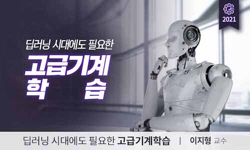

  
<h1 align="center">
  
Advanced machine learning

  
</h1>
  
<b>K-MOOC • 2023</b>
 
Instructor : Jee-Hyong Lee(Professor, Sungkyunkwan University)

 

Lecture notes for courses [Advanced machine learning](https://www.kmooc.kr/view/course/detail/5928?tm=20251016130104) (딥러닝 시대에도 필요한 고급기계학습).

## Lecture Notes

- [Graphical Model(GM)](lec01/README.md)

  > Probability, Conditional Probability, Bayesian Reasoning, Independence

- [Bayesian Network Overview](lec02/README.md)

  > Probabilistic Reasoning, Bayesian Network

- [Non-Linear SVM](lec09/README.md)

  > Non-Linear SVM, Kernel Trick

- [Gaussian Process](lec12/README.md)

  > Gaussian Distribution, Covariance Matrix, Gaussian Process

- [Singular Value Decomposition(SVD)](lec13/summary01/README.md)

  > Linear Transformation, eigenvalue, eigenvector, Singular Value Decomposition

- [Gaussian Mixture Model(GMM)](lec14/summary01/README.md)

  > Gaussian Mixture Model

## :mag: Syllabus

### 1. Graphical Model

### 2. Bayesian Network

### 3. Hidden Markov Model

### 4. Genetic Algorithm

### 5. Support Vector Machine

### 6. Random Forest

### 7. Adaboost

### 8. Gaussian Process

### 9. Matrix Factorization

### 10. Gaussian Mixture Model