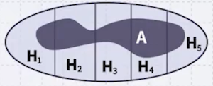

# 1 Graphical Model(GM)

확률 모델로는 Naive Bayesian Model, Bayesian Network, Hidden Markov Model(HMM) 등이 있다.

---

## 1.1 Probability

A와 B가 사건(event)이라고 하자.

- If $A \subseteq B \subseteq U$ then $0 \leq P(A) \leq P(B) \leq 1$

  A 사건이 B 사건에 포함되어 있다면, A 사건이 일어날 확률은 B 사건이 일어날 확률보다 작거나 같다.

  ---

- If $A, B \subseteq U$ then $P(A,B) + P(A,\lnot B) = P(A)$ (두 가지 곱사건을 활용한 확률 계산) 

  P(A,B) : A와 B가 동시에 일어날 확률, P(A,¬B) : A는 일어나고 B는 일어나지 않을 확률로, 두 확률을 더하면 A가 일어날 확률이 된다.

  ---

- If $A, B \subseteq U$ then $P(A \ or \ B) = P(A) + P(B) - P(A,B)$ (조건을 갖는 확률)

  A 또는 B가 일어날 확률은, A가 일어날 확률과 B가 일어날 확률을 더한 후, A와 B가 동시에 일어날 확률을 빼준 값이다.

  ---

- If $H_i \subseteq U$ for $1 \le i \le n$ , $H_i \cap H_j = \phi$ whenever $i \neq j$ and 

  $H_i \cup H_2 \cup ... \cup H_n = U$ then $P(A) = P(A, H_1)+ P(A, H_2) + ... + P(A, H_n)$ (두 번째 공식의 일반화)

  > (비유) 바게트 잘라먹기. P(A)를 구하기 어려울 때, 더 쉬운 각 조각 단위에서 확률을 구하려는 목적.

---

## 1.2 Conditional Probability

> e.g., Bayesian Approach는 조건부 확률에 기반한 방법론

P(A given B), B가 일어났을 때(일어났다고 가정할 때) A가 일어날 확률을 의미한다.

$$ P(A|B) = \frac{P(A,B)}{P(B)} $$

B가 일어났다고 가정한 것으로, 사실상 해당 조건부 확률은 **B가 전체집합**이 된다. (따라서, 분모로 들어가게 된다.) 그리고, A와 B가 동시에 일어날 확률이 분자에 들어가게 된다.

---

### 1.2.1 Variations

> Given은, 분모의 전체집합이 변경되는 것으로 생각할 수 있다.

(1) B, C가 일어났을 때 A가 일어날 확률.

$$ P(A|B,C) = \frac{P(A,B,C)}{P(B,C)} $$

앞서 조건부 확률 공식을 활용하면, 다음과 같이 변형할 수 있다.

$$ P(A|B,C) = \frac{P(A,B|C)}{P(B|C)} $$

(2) If $A \subseteq B \subseteq U$ then

$$ 0 \le P(A|C) \le P(B|C) \le 1 $$

(3) If $A, B \subseteq U$ then

$$ P(A,B|C) + P(A,\lnot B|C) = P(A|C) $$

(4) If $A, B \subseteq U$ then

$$ P(A \ or \ B|C) = P(A|C) + P(B|C) - P(A,B|C) $$

> 조건부 확률을 응용해 다음과 같은 공식도 획득할 수 있다.
>
> $P(A) = P(A, H_1)+ P(A, H_2) + ... + P(A, H_n)$
>
> $\quad = P(A|H_1)P(H_1) + P(A|H_2)P(H_2) + ... + P(A|H_n)P(H_n)$

(5) **Chaining Rule**. A, B, C, D가 동시에 일어날 확률.

$$ P(A,B,C,D) = P(A|B,C,D)P(B|C,D)P(C|D)P(D) $$

> 동시에 일어났다고 가정할 때, 순서는 중요하지 않다. $P(A,B,C,D)=P(B,C,A,D)=...$
>
> 예를 들어, $=P(B|C,A,D)P(C|A,D)P(D)$ 와 같이 변형할 수 있다.

---

### 1.2.2 Prior vs. Posterior Probability

prior probabilty는 아무런 증거(evidence) 없이 사전지식만으로 판단한다. 

- P(event). 예를 들어 주사위를 던졌을 때, 1의 눈이 나올 확률은 사전지식이 없으므로 1/6

그러나, 예를 들어 어느 주사위를 던졌을 때 10번 모두 1의 눈이 나왔다고 하자. posterior probability는 이러한 증거를 바탕으로 판단한다. (조건부 확률과 거의 동의어)

- P(event|evidence).

---

## 1.3 Bayesian Reasoning

다음은 Bayesian Rule이다. 두 조건부 확률 중 구하기 쉬운 조건부 확률을 이용할 수 있다.

- For $B, A \subseteq U$ then

$$ P(B|A) = \frac{P(A|B)P(B)}{P(A)} $$

> 언제 사용하는가: P(B|A)를 구하기는 어려울 수 있어도, (우변의) P(A|B), P(B), P(A)는 구하기 쉬운 경우가 종종 있다.

이를 앞서 바게트로 비유한 식에 적용할 수 있다.

- If $H_1 \cup H_2 \cup ... \cup H_n = S$ and $H_i \cap H_j = \phi$ whenever $i \neq j$ then

$$ P(H_i|A) = \frac{P(A|H_i)P(H_i)}{P(A|H_1)P(H_1) + P(A|H_2)P(H_2) + ... + P(A|H_n)P(H_n)} $$

해당 예시에서, $P(H_i|A)$는 구하기 어렵겠지만, $P(A|H_i)$를 비롯한 나머지 항은 구하기 쉬울 수 있다.

---

### 1.3.1 Example

어떤 주머니 안에 동전이 3개 있다고 생각해 보자. 이때 C1은 앞면(head)만 존재하고, C2는 앞면과 뒷면(tail), C3는 뒷면만 존재한다.

- 주머니에서 어떤 동전을 뽑을 때 확률

$$ P(C1) = P(C2) = P(C3) = \frac{1}{3} $$

- C1을 뽑았을 때, 앞면이 나올 확률: $P(h|C1) = 1$

  C2를 뽑았을 때, 앞면이 나올 확률: $P(h|C2) = \frac{1}{2}$

  C3를 뽑았을 때, 앞면이 나올 확률: $P(h|C3) = 0$

그러나, 이를 뒤집어서 생각해 보자. $P(C1|h)$ 즉, 앞면이 나왔을 때 동전이 C1일 확률을 구하는 것은 혼동이 오기 쉽다. 이럴 때 Bayesian Rule을 활용할 수 있다.

$$ P(C1|h) = \frac{P(h|C1)P(C1)}{P(h)} = \frac{P(h|C1)P(C1)}{P(h|C1)P(C1) + P(h|C2)P(C2) + P(h|C3)P(C3)} $$

> 이처럼 계속 조건부 확률을 이용하면서 최종적으로 확률을 구할 수 있다.

---

## 1.4 Independence

확률의 독립(independence)은 오해하기 쉬운 개념이다. 두 사건의 교집합이 없는 것이 아닌, **확률적으로 독립**이라는 의미임에 주의해야 한다.

> A가 일어날 확률이 'B가 일어난 다음이든', 'B가 일어나지 않은 다음이든' 상관 없이 같다면 독립이다. (B는 evidence)

- $A$ is independent from $B$ iff

$$ P(A,B) = P(A)P(B) $$

$$ P(A|B) = P(A|\lnot B) = P(A) $$

B라는 증거가 있을 때, A가 일어날 확률의 변화가 없다면 B는 '생뚱맞은' 증거인 셈이다. 또한, 이처럼 독립이라면 $P()$ 내부의 **콤마가 곱으로 분리**되는 것이 특징이다.

- $A$ and $C$ are independent given $B$ iff

$$ P(A,C|B) = P(A|B)P(C|B) $$

$$ P(A|B,C) = P(A|B) $$

종종 오해하는 사례를 수식으로 확인해 보자.

- $A$ and $B$ are independent, then $A \cap B = \phi?$ 

  '거짓'이다.

- $P(A,B) = P(A)P(B)$ $\rightarrow$ $P(A,B|C)=P(A|C)P(B|C)$ for any $C$ ? 

  '거짓'이다.

- $P(A,B|C) = P(A|C)P(B|C)$ for given $C$ $\rightarrow$ $P(A,B) = P(A)P(B)$ ? 

  '거짓'이다. 

- $P(A,B|C) = P(A|C)P(B|C)$ for given $C$ $\rightarrow$ $P(A,B|D) = P(A|D)P(B|D)$ for any $D$ ? 

  '거짓'이다.

이처럼 $A, B$ 가 독립이라는 것은 special case임에 주의해야 한다. 이 둘이 독립적이라고 해서 다른 경우에 독립이라고 보장하기란 굉장히 어렵다.

---