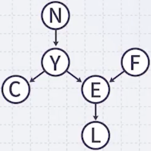
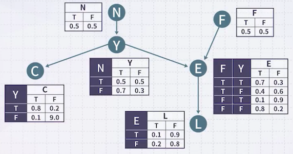
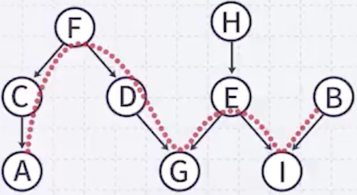
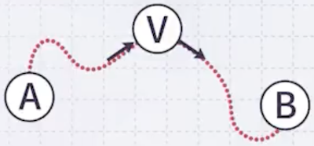
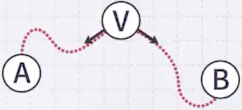
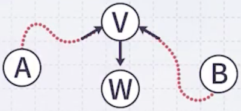
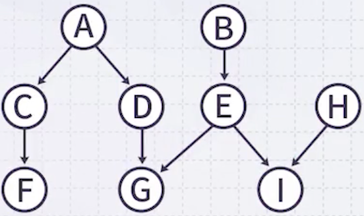

# 2 Bayesian Network(1)

---

## 2.1 Probabilistic Reasoning

다음과 같은 100일 동안의 고속도로 통계 데이터를 가지고 있다고 하자. 관찰변수는 Traffic, Construction, Accident 3가지이다.

| Traffic | Constr. | Accident | Prob. |
| :--: | :--: | :--: | :--: |
| H | T | T | 0.01 |
| H | T | F | 0.02 |
| H | F | T | 0.16 |
| H | F | F | 0.12 |
| N | T | T | 0.01 |
| N | T | F | 0.05 |
| N | F | T | 0.01 |
| N | F | F | 0.61 |

예를 들어, Heavy Traffic일 확률은 0.01 + 0.02 + 0.16 + 0.12이다. 

다른 예시로, 공사(Construction)가 있는 상황에서의 Heavy Traffic일 확률, 즉 `P(Traffic=H | Construction=T)`는 다음과 같이 계산한다.

- 분자: 0.01 + 0.02 = 0.03

- 분모: 0.01 + 0.02 + 0.01 + 0.05 = 0.09

- 답: 1/3

이처럼 어떠한 관찰, '어떠한 증거가 있는 상황에서의 (조건부) 확률'을 구하는 방법을 **Probabilistic Reasoning**이라고 한다.

---

## 2.2 Bayesian Network Overview

조금 변수 개수를 늘려보자. 가령 15개의 변수가 값을 3개씩 가진다고 하자. 

- 모든 경우의 수: $3^{15} = 14,348,907$ 개 (즉, 데이터가 1400만 개가 필요하다.)

현재 1만 개 데이터만 확보하여 데이터가 부족한 상황이어도, Bayesian Network를 활용해 확률 추론이 가능하다. 이때 필요한 것은 **사전지식**(Expert Knowledges)과 **가정**이다.

**Probability(Statistics)** + **Expert Knowledge on Direct Cause** + **Some Assumption on Independency**

> 여기서 말하는 지식이란, 여러 사건(events) 사이의 직접 원인(**direct cause**)을 뜻한다.

---

### 2.2.1 Example

질문은 다음과 같다. 사전지식을 바탕으로 해당 질문에 답해 보자.

- $P(M | \lnot S)$ : 당신이 열심히 공부하지 않았을 때( $\lnot$ Study Hard )도, 어머니가 행복(Mom Happy)할 확률은 얼마인가? 

이때 다음과 같이 3가지 지식을 가지고 있다. 첫 번째 지식에는 Study Hard라는 사건과 Good Grade라는 두 가지 사건이 있다. 

| Knowledge |
| --- |
| If you `study hard`, you have a `good grade`. |
| If you have a `good grade`, your `mom is happy`. |
| If your `mom is happy`, she makes a `delicious dinner` for you. |

Study Hard는 Good Grade의 direct cause이다.

> - Direct cause relation
>
>   **'S'tudy Hard** $\rightarrow$ **'G'ood Grade** $\rightarrow$ **'M'om Happy** $\rightarrow$ **'D'elicious Dinner**

다음은 causes and effects와 $P(X\|parent(X))$ 를 나타낸다.

| Cause and Effect |  | |
| :---: | :---: | :---: |
| **S**tudy Hard $\rightarrow$ **G**ood Grade | $P(G\|S)=0.7$   $P(\lnot G\|S)=0.3$ | $P(G\|\lnot S)=0.1$   $P(\lnot G\| \lnot S)=0.9$ |
| **G**ood Grade $\rightarrow$ **M**om Happy | $P(M\|G)=0.8$   $P(\lnot M\|G)=0.2$ | $P(M\|\lnot G)=0.3$   $P(\lnot M\| \lnot G)=0.7$ |
| **M**om Happy $\rightarrow$ **D**elicious Dinner | $P(D\|M)=0.9$   $P(\lnot D\|M)=0.1$ | $P(D\|\lnot M)=0.2$   $P(\lnot D\| \lnot M)=0.8$ |

이를 앞서 direct cause relation 관점에서 정리하면 다음과 같다.

| 'S'tudy Hard $\rightarrow$ | 'G'ood Grade $\rightarrow$ | 'M'om Happy $\rightarrow$ | 'D'elicious Dinner |
| --- | --- | --- | --- |
| $P(S) = 0.5$ | $P(G\|S) = 0.7$   $P(G\|\lnot S) = 0.1$ | $P(M\|G) = 0.8$   $P(M\|\lnot G) = 0.3$ | $P(D\|M) = 0.9$   $P(D\|\lnot M) = 0.2$ |

이제 $P(M | \lnot S)$ 를 구해 보자.

1. Good Grade 사건을 끼워 넣는다.

$$P(M| \lnot S) = P(M,G | \lnot S) + P(M, \lnot G | \lnot S)$$

> lecture 1의 바게트 비유: $P(A) = P(A, B) + P(A, \lnot B)$ ($B$ : 어떤 event나 대입해 볼 수 있다.)

2. Chaining Rule을 적용한다.

$$ P(M,G | \lnot S) = P(M|G, \lnot S)P(G|\lnot S) $$

$$ P(M, \lnot G | \lnot S) = P(M|\lnot G, \lnot S)P(\lnot G|\lnot S) $$

그러나, 이것만으로는 확률을 구할 수 없다. 여기서 독립에 대한 가정을 추가한다.

> - S(Study Hard) - G(Good Grade)가 독립인가?
>
>   '아니다'. ('S'가 일어났으면 0.7, '안 일어났으면 0.1으로 Good Grade의 확률을 바꾸고 있다. = 종속이다.)

> - S(Study Hard) - M(Mom Happy)가 독립인가?
>
>   '아니다'. (S는 G를 initiate하고, G는 M을 initiate한다. 따라서 S는 M에 영향을 미친다. = 종속이다.)

3. 'G'가 주어졌다(given)고 해 보자. 

G가 주어졌는데, 당신은 공부를 열심히 했는지 안 했는지 모르지만 좋은 성적을 얻었다. 

- 그렇다면, 어머니가 행복할 확률은 0.8로 고정이 된다.

- 이 경우, 어머니의 행복이 성적에 의해서만 결정된다는 것이므로, S(Study Hard)와 M(Mom Happy)는 독립이 된다.

> 이처럼 Direct cause relation에서 두 노드 사이에 **끼어 있는 노드의 값이 주어진다면**(given), 두 노드는 독립이 된다.

---

### 2.2.2 Bayesian Network Assumption

어떤 노드의 PARENT가 주어졌을 때, 그 노드는 해당 PARENT보다 위쪽에 있는 모든 노드와 독립이다.

이러한 가정은 실제로 그럴 수도 있고 아닐 수도 있지만, <U>그렇다고 말하는 게 항상 더 합리적이기 때문에, 그렇다라고 가정</U>한다.

---

## 2.3 Bayesian Network

Bayesian Network는 다음과 같이 정의한다.

- Bayesian Network는 여러 사건(event)이 있고, 그 사이에 direct cause relation이 주어진다. (이는 인간이 주는 것이다.)

  - Direct cause relation를 바탕으로 **Directed Acyclic Graph**(DAG)가 구성된다.

- 모든 노드는 조건부 확률 $P(X|parent(X))$ 이 주어진다. (조건부 확률은 관찰에 의해 얻어지는 것이다.)

- 어떤 노드의 부모가 주어진다면, 그 노드는 부모보다 위쪽에 있는 노드와 독립이다.

$$ P(X|W, parent(X)) = P(X|parent(X)) $$

> - node $X$ : random variable (event)
>
> - $W$ : X의 부모 parent(X) 및 자손을 제외한 모든 조상 노드

다음은 Bayesian Network를 표현한 예시다.

- 노드: event

- 화살표: Direct cause (예를 들어 N은 Y를 directly cause한다.)

노드 Y를 보면, N이 True일 때와 False일 때의 확률이 다르다. 이처럼 조건부 확률, 부모가 주어졌을 때 자식의 확률로 표현한다. (참고로 E는 부모가 두 개 있는 경우이다.)

---

### 2.3.1 Dependency in Bayesian Network

앞서 Bayesian Network의 세 번째 가정( $P(X|W, parent(X)) = P(X|parent(X))$ )은 독립 여부를 판단하기 어렵다. 대신, equivalent한 다른 기준이 있다.

- If $A$ and $B$ are **d-separated**, $A$ and $B$ are independent.

앞서 Bayesian Network 예시를 바탕으로 독립 여부를 판단해 보자.

---

### 2.3.2 d-separation

다음 예시에서 A와 B가 독립인지 판단해 보자. 먼저, A와 B 사이의 undirected path를 찾는다. ( $\lbrace C, F, D, F, G, E, I \rbrace$ )

$A$ 와 $B$ 사이 undirected path의 어떤 노드 $V$ 가 세 가지 조건 중 하나를 만족하면, $A$ 와 $B$ 는 **d-separation**이다.

- 조건 1: $V$ 가 하나의 incoming arrow와 outgoing arrow를 가지며, $V$ 가 given.

- 조건 2: $V$ 가 두 개의 outgoing arrow를 가지며, $V$ 가 given.

- 조건 3: $V$ 가 두 개의 incoming arrow와 descendant $W$ 를 가지며, $V$ 가 given이 아님

| | |
| :---: | :---: |
|  | $P(A,B\|V) = P(A\|V)P(B\|V)$ |
|  | $P(A,B\|V) = P(A\|V)P(B\|V)$ |
|  |  |

---

### 2.3.3 Example

다음 예제를 바탕으로 독립 여부를 판단해 보자.

| Question | Answer |
| --- | --- |
| $A, B$ ? | $G$ 에서 조건 3 만족 |
| $A, B$ given $G$ ? | 조건 불만족(종속) |
| $A, B$ given $D$ ? | $D$ 에서 조건 1 만족 |
| $A, B$ given $D$ and $G$ ? | 몇 개 given이든 상관 없이, 이미 $D$ 에서 만족하므로 독립 |
| $F, H$ ? | $G$ 와 $I$ 에서 조건 3 만족 |
| $F, H$ given $G$ ? | 여전히 $I$ 에서 조건 3 만족 |
| $F, H$ given $G$ and $I$ ? | 조건 불만족(종속) |

---