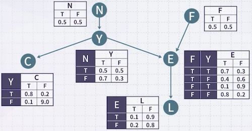
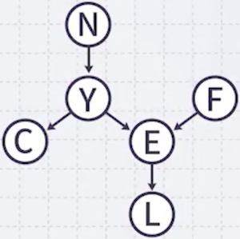
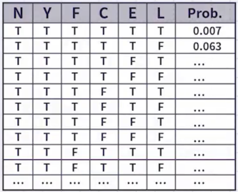
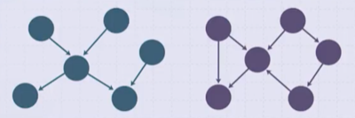
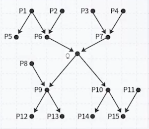

# 3 Bayesian Network(2)

Bayesian Network는 direct cause relation, directed acyclic graph(DAG)으로 정의하였다. (사람의 expert knowledge에서 얻는다.) 

이때 각각의 노드는 조건부 확률을 가지고 있으며, 조건부 확률 테이블은 부모가 주어졌을 때의 확률에 해당하는 값을 가졌다.

---

## 3.1 Inference in Bayesian Nets

다음 그래프에서 $N, L$ 은 일어나지 않고 $Y, F, C, E$ 는 일어날 확률을 구해볼 것이다.

$$ P (\neg N, Y, F, C, E, \neg L) $$

이는 세 가지 단계를 거쳐 계산할 수 있다.

**(1)** 위상 정렬(**topological sort**): 더 이상 빠져나갈 화살표가 없는 순서대로 정렬

$$ P (\neg L, E, C, Y, F, \neg N) $$

> L을 적고 제외하면, 다음에는 C, E 중 하나를 먼저 적는다. 이 다음에는 Y, F 중 하나를 먼저 적고 마지막에 N을 적는다.

**(2)** **chaining** 적용: 조건부 확률을 이용하여 쪼개기

$$ P (\neg L | E, C, Y, F, \neg N) \times P (E | C, Y, F, \neg N) \times P (C | Y, F, \neg N) \times P (Y | F, \neg N) \times P (F | \neg N) \times P (\neg N) $$

**(3)** **d-separation** 적용

$$ P(\neg L | E) \times P(E | Y, F) \times P(C | Y) \times P(Y | \neg N) \times P(F) \times P(\neg N) $$

> 예를 들어 $P (\neg L | E, C, Y, F, \neg N)$ 는 부모 $E$ 가 주어졌으니까, 부모 위쪽 노드와는 모두 독립이 된다. $= P(\neg L | E)$

---

### 3.1.1 General Case

앞서 joint probabilty와 달리, 다음과 같은 일반적인 확률에서는 좋은 solution이 존재하지 않는다.

- $P(C, F | L, N)$

- $P(\neg N | E)$

- $P(\neg C | L)$

모든 확률 변수의 joint probabilty를 구하는 것을 고려할 순 있지만, NP-hard하여 시간이 오래 걸린다는 단점이 있다.

이를 빨리 계산하기 위한 근사 알고리즘이 존재하며, singly connected polytree 구조에서는 근사 없이 효율적인 알고리즘도 존재한다.

---

## 3.2 Inference in Polytrees

아래 두 그래프 예시에서 화살표의 머리를 모두 생략(**undirected**)하고 해석했을 때, 왼쪽 그래프는 cycle이 존재하지 않는다. 이러한 그래프를 **polytree**(singly connected DAG)라고 한다.

> 오른쪽 그래프는 cycle이 존재한다. (polytree 아님)

polytree를 이용한 추론은 세 가지가 있다. (given: evidence)

| Case | Example |
| --- | --- |
| - **All Evidence Above Case**   $\quad P(Q\|P_5, P_4)=?$    - **All Evidence Below Case**   $\quad P(Q\|P_{12}, P_{13}, P_{14}, P_{11})=?$    - **All Evidence Above and Below Case**   $\quad P(Q\|P_{5}, P_{4}, P_{12}, P_{13}, P_{14}, P_{11})=?$ |  |

> 화살표를 고려하지 않는다 (undirected). $Q$ 를 기준으로 위에 있는가 아래 있는가가 중요하다.

---

### 3.2.1 All Evidence Above Case

$P(Q | P_5, P_4)$ 사례를 계산해 보자.

**(1)** 먼저 $Q$ 의 parent( 부모: $P_6, P_7$ )를 활용하여 쪼갠다.

$$\begin{align*}
P(Q | P_5, P_4) &= \sum_{P_6, P_7} P(Q, P_6, P_7 | P_5, P_4) \\
&=  \sum_{P_6, P_7} P(Q | P_6, P_7, P_5, P_4) P(P_6, P_7 | P_5, P_4)
\end{align*}$$

**(2)** d-separation을 적용한다.

$$ P(Q|P_5, P_4) = \sum_{P_6, P_7} P(Q|P_6, P_7) P(P_6 | P_5) P(P_7 | P_4) $$

**(3)** 조건부 확률 테이블에 존재하는 확률이 나올 때까지 반복한다.

> 예를 들어 $P(Q|P_6, P_7)$ 는 테이블에 존재하므로, 나머지 $P(P_6 | P_5)$ 와 $P(P_7 | P_4)$ 는 반복하여 계산해야 한다.

$$\begin{align*}
P(P_6 | P_5) &= \sum_{P_1, P_2} P(P_6 | P_1, P_2 | P_5 ) \\
&= \sum_{P_1, P_2} P(P_6 | P_1, P_2, P_5) P(P_1, P_2 | P_5) \\
&= \sum_{P_1, P_2} P(P_6 | P_1, P_2) P(P_1 | P_5) P(P_2 | P_5) \\
&= \sum_{P_1, P_2} P(P_6 | P_1, P_2) P(P_1 | P_5) P(P_2)
\end{align*}$$

> $P(P_1 | P_5)$ 를 제외하면 모두 테이블에서 갖는 값이다. 이때 $P(P_1 | P_5)$ 는 **all evidence below**에 해당한다. (구하는 방법은 아래 문단 참고)

$$\begin{align*}
P(P_7 | P_4) &= \sum_{P_3} P(P_7, P_3 | P_4) \\
&= \sum_{P_3} P(P_7 | P_3, P_4) P(P_3 | P_4) \\
&= \sum_{P_1} P(P_7 | P_3, P_4) P(P_3)
\end{align*}$$

---

### 3.2.2 All Evidence Below Case

$P(Q|P_{12}, P_{13}, P_{14}, P_{11})=?$ 사례를 계산해 보자.

**(1)** Bayesian rule 적용

$$ P(Q|P_{12}, P_{13}, P_{14}, P_{11}) = \frac{P(P_{12}, P_{13}, P_{14}, P_{11}|Q)P(Q)}{P(P_{12}, P_{13}, P_{14}, P_{11})} $$

**(2)** All Evidence Above 절차 적용

$$\begin{align*}
P(P_{12}, P_{13}, P_{14}, P_{11}|Q) &= \sum_{P_9, P_{10}} P(P_{12}, P_{13}, P_{14}, P_{11}, P_9, P_{10} | Q) \\
&= \sum_{P_9, P_{10}} P(P_{12}, P_{13}, P_{14}, P_{11} | P_9, P_{10}, Q) P(P_9, P_{10} | Q) \\
&= \sum_{P_9, P_{10}} P(P_{12} | P_9 ) P(P_{13} | P_9 ) P(P_{14} | P_{10} ) P(P_{11}) P(P_9 | Q) P(P_{10} | Q)
\end{align*}$$

$$\begin{align*}
P(Q) &= \sum_{P_6, P_7} P(Q, P_6, P_7) \\
&= \sum_{P_6, P_7} P(Q | P_6, P_7) P(P_6, P_7) \\
&= \sum_{P_6, P_7} P(Q | P_6, P_7) P(P_6) P(P_7)
\end{align*}$$

---

### 3.2.3 All Evidence Above and Below Case

$P(Q | P_5, P_4, P_{12}, P_{13}, P_{14}, P_{11})$ 를 구해 보자.

**(1)** 먼저 evidence above와 evidence below를 나눈다.

$$ E^{+} = \{P_5, P_4\} , \quad E^{-} = \{P_{12}, P_{13}, P_{14}, P_{11}\} $$

$$ P(Q|P_5, P_4, P_{12}, P_{13}, P_{14}, P_{11}) = P(Q|E^{+}, E^{-}) $$

**(2)** Bayesian rule을 적용한다.

$$ P(Q|E^{+}, E^{-}) = \frac{P(E^{-}|Q, E^{+}) P(Q|E^{+})}{P(E^{-}|E^{+})} $$

**(3)** 위 과정을 반복한다.

---

### 3.2.4 Example

앞서 예제에서 방법을 적용해 보자.

$$ P(Y|E) = ? $$

$$ P(Y|E) = \frac{P(E|Y) P(Y)}{P(E)} $$

$$ P(Y) = \sum_{N} P(Y|N) P(N) = P(Y|N)P(N) + P(Y| \neg N)P(\neg N) $$

$$ P(E|Y) = \sum_{F} P(E|F, Y) P(F) = P(E|F, Y) P(F) + P(E| \neg F, Y) P(\neg F) $$

$$\begin{align*}
P(E) &= \sum_{Y, F} P(E,Y,F) = \sum_{Y,F} P(E|Y,F) P(Y,F) = \sum_{Y,F} P(E|Y,F) P(Y) P(F) \\
&= P(E|Y, F)P(Y)P(F) + P(E|Y, \neg F)P(Y)P(\neg F) + P(E| \neg Y, F)P(\neg Y)P(F) + P(E| \neg Y, \neg F)P(\neg Y)P(\neg F)
\end{align*}$$

---