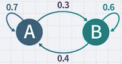
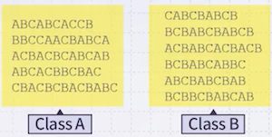
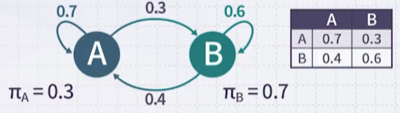
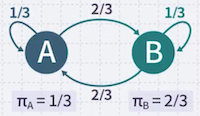
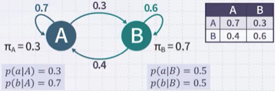
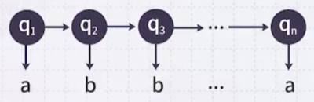
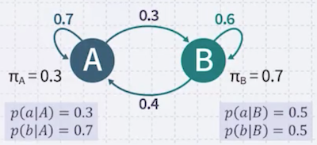

# 4 Hidden Markov Model(1)

Hidden Markov Model은 sequence processing을 위한 확률 모델이다.

> e.g., Sentimental analysis: 예를 들어, 리뷰 문장이 긍정적인지 부정적인지 판단하는 문제

---

## 4.1 Markov Models

**Markov Model**은 **final state machine**이다. 예를 들어, A와 B state가 있으며 state의 transition이 존재한다.

| 예시 | 특정 state에서 시작할 확률 | 랜덤하게 state가 변화할 확률 |
| :---: | :---: | :---: |
|  | $P(q_0 = A) = {\pi}_A = 0.3$   $P(q_0 = B) = {\pi}_B = 0.7$  | $P(A \rightarrow B) = P(q_{t+1} = B \| q_t = A) = 0.3$   $P(A \rightarrow A) = P(q_{t+1} = A \| q_t = A) = 0.7$   $P(B \rightarrow A) = P(q_{t+1} = A \| q_t = B) = 0.4$   $P(B \rightarrow B) = P(q_{t+1} = B \| q_t = B) = 0.6$ |

> 예를 들어, 다음 예시는 A, B, C state에서 계속 변화하면서 생성된 sequence이다.
>
> 

다음 예시에서 AABBABAB 문장이 생성될 확률을 구해보자.

$$ \pi_{A} \times P(q_2 = A | q_1 = A) \times P(q_3 = B | q_2 = A) \times \cdots $$

$$ = 0.3 \times 0.7 \times 0.3 \times 0.6 \times 0.4 \times 0.3 \times 0.4 \times 0.3 $$

앞서 확률 계산을 수식으로 일반화하면 다음과 같다.

$$ p(q_1 \cdots q_{t-1} q_t) = \pi_{q_1} \prod^t p(q_i | q_{i-1}) $$

> AABBABAB에서, 가장 높은 확률의 다음 상태는?: B(0.6) 

---

### 4.1.1 Markov Models: Some Questions

반대로 특정 state로 시작할 확률을 몰라도, 이미 생성된 문자열을 토대로 추론할 수 있다.

- 관찰: ABBBABA, BABBAAB, BABA, AB, BAA, BBAA

**(1)** 6개 문장 중에서, A로 시작한 문장은 2개, B로 시작한 문장은 4개이다.

$$\pi_A = 1/3, \quad \pi_B = 2/3$$

**(2)** A에서 A로 간 개수, A에서 B로 간 개수를 센다.

$$ p(q_t = A | q_{t-1} = A) = 3/9, \quad p(q_t = B | q_{t-1} = A) = 6/9 $$

> e.g., ABBBABA: `AB`BB`AB`A 두 번

**(3)** B에서 A로 간 개수, B에서 B로 간 개수를 센다.

$$ p(q_t = A | q_{t-1} = B) = 9/12, \quad p(q_t = B | q_{t-1} = B) = 4/12 $$

---

## 4.2 Hidden Markov Models

**Hidden Markov Model**(HMM)은 기계의 **state를 관찰할 수 없다**는 가정으로 시작한다. 즉, 지금 기계가 A state인지 B state인지 알 수 없다.

대신, **출력을 관찰**할 수 있다. 만약 기계가 소문자 a를 출력했다면 state는 무엇일까?

- $A$ state일 경우: 0.3의 확률 ( $P(a|A) = 0.3$ )

- $B$ state일 경우: 0.5의 확률 ( $P(a|B) = 0.5$ )

이처럼 $q_t$ 라는 state는 관찰할 수 없으며, 대신 확률적으로 출력되는 a, b만을 관찰할 수 있다.

앞서 예시에서 abababab를 출력할 확률을 구하면 다음과 같다. (상수를 계속 곱하면 된다.)

$$ p(o_1 o_2 \cdots o_t | q_1 q_2 \cdots q_t) = \prod^t p(o_i | q_i) $$

반대로 출력이 주어졌을 때(given) 역시, state transition 확률을 추정할 수 있다.

$$ p(q_1 q_2 \cdots q_t | o_1 o_2 \cdots o_t) = \frac{p(o_1 o_2 \cdots o_t | q_1 q_2 \cdots q_t) p(q_1 q_2 \cdots q_t)}{p(o_1 o_2 \cdots o_t)} $$

---

### 4.2.1 Formal Definition

일반적으로 HMM은 세 가지 파라미터를 포함한 $\lambda = (\boldsymbol{A, B, \pi})$ 식으로 정의한다.

- $\boldsymbol{A}$: transition 확률 (transition probability)

- $\boldsymbol{B}$: 각 state에서 어떤 출력을 생성할지 확률 (output probability)

- $\boldsymbol{\pi}$: 처음 어떤 state로 시작할지 확률 (initial probability)

> State = $\lbrace s_1, s_2, \cdots, s_n \rbrace$ , output = $\lbrace o_1, o_2, \cdots, o_m \rbrace$

---

### 4.2.2 Three Basic Problems for HMM

HMM에서 주로 계산하는 세 가지 문제는 다음과 같다.

- **(1)** 출력 문장 $O$ 와 $\lambda$ 가 주어졌을 때, $P(O | \lambda)$ 

- **(2)** 출력 문장 $O$ 가 주어졌을 때, 가장 높은 확률로 문장을 출력할 $\lambda$ (maximize $P(O | \lambda)$ )

- **(3)** 출력 문장 $O$ 와 $\lambda$ 가 주어졌을 때, 문장 생성 과정에서의 state sequence 추론

---

## 4.3 Problem 1

> 문제: 출력 문장 $O$ 와 $\lambda$ 가 주어졌을 때, $\lambda$ 가 출력 문장을 생성할 확률 $P(O | \lambda)$ ?

먼저 HMM 내부에서 state transition에 주목한다.

$$ P(O | \lambda) = \sum_{q} P(O | Q, \lambda) P(Q | \lambda) $$

**(1)** 예를 들어 `ababab`가 출력 문장이라고 하면, state $q_1$ 에서 $o_1$ (`a`) 가 나올 확률, $q_{2}$ 에서 $o_{2}$ (`b`) 가 나올 확률, ... 을 곱하면 된다.

$$ P(O |Q, \lambda) = \prod_{t=1}^{T} P(o_t | q_t , \lambda) $$

$$ = b_{q_1} (o_1) \cdots b_{q_r} (o_r) $$

**(2)** state가 $q_1$ 에서 $q_2$ 로 transition할 확률, $q_2$ 에서 $q_3$ 로 transition할 확률, ... 을 곱하면 된다.

$$P(Q|\lambda) = \pi_{q_1} a_{q_1 q_2} a_{q_2 q_3} \cdots a_{q_{T-1} q_T}$$

앞서 두 계산을 합치면 다음 수식으로 정리할 수 있다.

$$ P(O|\lambda) = \sum_{q_1 \cdots q_r} \pi_{q_1} b_{q_1} (o_1) a_{q_1 q_2} b_{q_2} (o_2 ) \cdots a_{q_{T-1} q_T} b_{q_T} (o_T) $$

그러나, $q$ 의 개수에 주의해야 한다. 가능한 state transition 개수 $N$ 이 얼마나 큰가에 따라, 연산이 지수적으로 증가한다.

- \#possible sequences = $N^T$ ( $T$ 출력 문장 길이 )

- **forward-backward procedure**를 사용하면 효율적으로 계산할 수 있다.

> 예를 들어, 문장 길이가 10이며 가능한 state가 A, B로 2라면, 2^10 = 1024개 항을 모두 더해야 한다.

---

### 4.3.1 Forward Procedure

> Dynamic Programming으로 확률을 구해가는 과정이 필요하다.

앞서 `ababab`를 출력했고 state는 A, B를 가졌다. 

먼저, 마지막 `b`를 출력한 state가 A라고 가정하고, 해당 가정의 확률을 구해보자.

> 이후 B인 경우의 확률도 구해서 더하면 된다.

- 다섯 번째 B state에서 A로 갈 확률 \* 다섯 번째 A state에서 A로 갈 확률

$$ p(ababab, q_6 = A | \lambda) = p(ababab, q_5 = A, q_6 = A | \lambda) + p(ababab, q_5 = B, q_6 = A | \lambda) $$

각 항을 변환하면 다음과 같다.

$$ p(ababab, q_5 = A, q_6 = A | \lambda) = p(ababa, q_5 = A | \lambda) \cdot p(q_6 = A | q_5 = A, \lambda) p(b | A, \lambda) $$

$$ p(ababab, q_5 = B, q_6 = A | \lambda) = p(ababa, q_5 = B | \lambda) \cdot p(q_6 = A | q_5 = B, \lambda) p(b | A, \lambda) $$

- 여기서 $t$ 번째 state가 $s$ 일 확률을 $\alpha_t (s) = p(o_1 o_2 \cdots o_t , q_t = s | \lambda)$ 로 치환하면 다음과 같다.

$$ p(ababab, q_5 = A , q_6 = A | \lambda ) = \alpha_5(A) a_{AA} b_A(b) $$

$$ p(ababab, q_5 = B, q_6 = A | \lambda) = \alpha_5(B) a_{BA} b_A(b) $$

전체 식을 정리하면 다음과 같다.

$$ \alpha_6 (A) = (\alpha_5 (A) a_{AA} + \alpha_5(B) a_{BA}) b_A(b) $$

요약하자면, $q_6 = A$ 일 때 `ababab` 확률과 $q_6 = B$ 일 때 `ababab` 확률을 더해주면 된다.

$$ p(ababab | \lambda) = \alpha_6(A) + \alpha_6(B) $$

일반화한 수식은 다음과 같다.

- $i$ : state

$$ p(O | \lambda) = \sum_{i=1}^{N} \alpha_T(i) $$

> **forward variable**
>
> $$ \alpha_t (i) = P (o_1 \cdots o_t , q_t = S_i | \lambda) $$
>
> **(1)** Initialization
>
> $$ \alpha_t (i) = \pi_i b_i (o_1) $$
>
> **(2)** Induction
>
> $$ \alpha_{t+1}(j) = [ \sum_{i=1}^N \alpha_t(i)a_{ij}]b_j(o_{t+1}) $$
>
>**(3)** Termination
>
> $$ P(O | \lambda) = \sum_{i=1}^{N} \alpha_T(i) $$

---

### 4.3.2 Backward Procedure

$$ \beta_t (i) = P(o_{t+1} \cdots o_T | q_t = S_i , \lambda) $$

3단계 절차는 다음과 같다.

**(1)** Initialization

$$ \beta_T(i) = 1 $$

**(2)** Induction

$$ \beta_t(i) = \sum_{j=1}^N \alpha_{ij} b_j (o_{t+1})\beta_{t+1}(j) $$

**(3)** Termination

$$ P(O | \lambda) = \sum_{i=1}^{N} \pi_i b_i (o_1) \beta_1(i) $$

---

### 4.3.3 Combination of Forward and Backward

앞서 두 procedure를 결합할 수 있다.

$$
\begin{aligned}
P(O , q_t = i | \lambda) &= P(o_1 , \cdots, o_T, q_t = i | \lambda) \\
&= P(o_1, \cdots , o_{t-1}, q_t = i, o_t, \cdots, o_T | \lambda) \\
&= P(o_1, \cdots , o_{t-1} | q_t = i, \lambda) \times P(o_t, \cdots, o_T | o_1, \cdots, o_{t-1}, q_t = i, \lambda) \\
&= P(o_1, \cdots , o_{t-1} | q_t = i, \lambda) \times P(o_t, \cdots, o_T | q_t = i, \lambda) \\
&= \alpha_t (i) \beta_t (i)
\end{aligned}
$$

정리하면 다음과 같다.

$$ P(O| \lambda) = \sum_{i=1}^{N} \alpha_T (i) \beta_T (i), 1 \leq t \leq T $$

---
