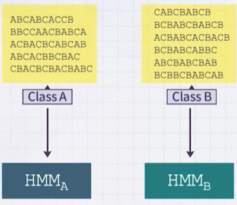
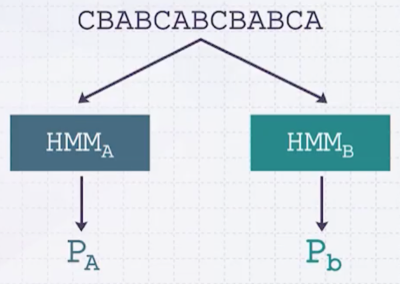

# 5 Hidden Markov Model(2)

---

## 5.1 Problem 2

> 문제: 출력 문장 $O$ 가 주어졌을 때, 가장 높은 확률로 문장을 출력할 $\lambda$ (maximize $P(O | \lambda)$ )

문장 $O$ 가 주어졌을 때 가장 높은 확률로 출력했을 것 같은 HMM을 추정(likelihood)해 보자.

$$ P(\lambda | O) = \frac{P(O | \lambda) P(\lambda)}{P(O)} $$

$P(\lambda)$ 가 모든 $\lambda$ 에서 일정하다고 가정하면, 아래 식에 따라 $P(\lambda | O)$ 는 $P(O | \lambda)$ 에 비례한다.

> $P(O)$ 는 이미 주어졌기(given) 때문에 상수이다. 

이때 **Expectation-Maximization**(EM) 알고리즘의 일종인 **Baum-Welch** 알고리즘으로 학습한다. 

---

### 5.1.1 Baum-Welch Algorithm: E Step

아래 $\xi_t, \gamma_t$ 를 알면, $\boldsymbol{\pi, A, B}$ 를 추정할 수 있다.

**(1)** 먼저 $\xi_t$ 를 정의해야 한다. 

- $O$ 가 주어졌을 때, $t$ 번째 state가 $q_t = S_i$ 이며, $t+1$ 번째 state가 $q_{t+1} = S_j$ 일 확률

$$\xi_t(i, j) = P(q_t = S_i, q_{t+1} = S_j | O, \lambda)$$

식을 다음과 같이 정리할 수 있다.

$$ \begin{align*}
\xi_t(i, j) &= \frac{\alpha_t(i) a_{ij} \beta_j(o_{t+1})\beta_{t+1}(j)}{P(O | \lambda)} \\
&= \frac{\alpha_t(i) a_{ij}b_j(o_{t+1})\beta_{t+1}(j)}{\sum_{i=1}^N \sum_{j=1}^N \alpha_t(i)a_{ij}b_j(o_{t+1})\beta_{t+1}(j)}
\end{align*} $$

**(2)** $\gamma_t(i)$ 를 정의한다. 

- $O$ 가 주어졌을 때 $q_t = i$ 일 확률 

$$ \gamma_t(i) = \sum_{j=1}^N \xi_t(i, j) $$

> **Notes**: 유용한 수식
>
> - $\sum_{t=1}^{T-1}\gamma_t(i,j)$ : $S_i$ 에서 transition할 확률
>
> - $\sum_{t=1}^{T-1}\xi_t(i,j)$ : $S_i$ 에서 $S_j$ 로 transition할 확률

---

### 5.1.2 Baum-Welch Algorithm: M Step

이제 $\boldsymbol{\pi, A, B}$ 를 추정할 수 있다.

**(1)** state $i$ 에서 시작할 확률

$$\begin{align*}
\pi_i &= \text{expected frequency in state } S_i \text{ at time } t = 0 \\
&= r_1(i)
\end{align*}$$

**(2)** state $i$ 에서 $S_j$ 로 transition할 확률

$$\begin{align*}
\bar{a}_{ij} &= \frac{\text{expected number of transitions from state } S_i \text{ to } S_j}{\text{expected number of transitions from state } S_i} \\
&= \frac{\sum_{t=1}^{T-1}\xi_t(i,j)}{\sum_{t=1}^{T-1}\gamma_t(i)}
\end{align*}$$

**(3)** state $j$ 에서 $k$ 라는 symbol을 출력할 확률

$$\begin{align*}
\bar{b}_{j}(k) &= \frac{\text{expected number of times state } S_j \text{ and observing } v_k}{\text{expected number of times in state } S_j} \\
&= \frac{\sum_{t=1, o_t=v_k}^{T-1}\gamma_t(j)}{\sum_{t=1}^{T}\gamma_t(j)}
\end{align*}$$

---

### 5.1.3 Summary

**(1)** $\boldsymbol{\pi, A, B}$ 를 무작위 초기화 ( state 수는 고정해야 한다. )

**(2)** $\boldsymbol{\pi, A, B}$ 바탕으로, 모든 $i,j,t$ 에서 $\xi_t(i,j), \gamma_t(i)$ 계산

**(3)** $\xi_t(i,j), \gamma_t(i)$ 바탕으로, 새로운 $\boldsymbol{\pi, A, B}$ 추정

**(4)** (2)~(3) 과정을 수렴할 때까지 반복

---

## 5.2 Problem 3

> 문제: 출력 문장 $O$ 와 $\lambda$ 가 주어졌을 때, 문장 생성 과정에서의 state sequence 추론

다시 말하면, $p(q_1, q_2, \cdots, q_T | O, \lambda)$ 를 최대화하는 문제가 된다.

먼저 $\delta_t(i)$ 를 정의한다.

- $o_1, \cdots, o_t$ 까지 출력했을 때, 마지막 state가 $s_i$ 일 (가장 높은) 확률

$$ \delta_t(i) = \max_{q_1, q_2, \cdots, q_{t-1}} p(q_1, q_2, \cdots, q_t = s_i, o_1, o_2, \cdots, o_t | \lambda) $$

- ${t+1}$ 까지 출력하고 $j$ 로 transition했을 때, $o_{t+1}$ 을 출력할 확률

$$\delta_{t+1}(j) = (\max_i \delta_t(i) a_{ij}) b_j(o_{t+1})$$

- $S_1, \cdots, S_n$ 로 $o_t$ 까지 출력한 뒤, $o_{t+1}$ 을 출력했을 때 가장 높은 확률의 state

$$ q_{t+1} = \arg \max_i \delta_t(i) a_{i, q_{t+1}} b_{q_{t+1}}(o_{t+1})$$

> **Notes**: 전개 과정
>
> $$\begin{align*}
> \delta_{t+1}(j) &= \max_{q_1, q_2, \cdots, q_{t-1}} p(q_1, q_2, \cdots, q_t = s_i, o_1, o_2, \cdots, o_t | \lambda)\\
> &= \max_{q_1, q_2, \cdots, q_{t-1}} \max_{q_t} p(q_1, q_2, \cdots, q_{t+1} = s_j, o_1, o_2, \cdots, o_{t+1} | \lambda) \\
> &= \max_{q_1, q_2, \cdots, q_{t-1}} \max_{1 \le t \le N} p(q_1, q_2, \cdots, q_t = s_i , q_{t+1} = s_j, o_1, o_2, \cdots, o_{t+1} | \lambda) \\
> &= \max_{q_1, q_2, \cdots, q_{t-1}} \max_{1 \le i \le N} p(q_1, q_2, \cdots, q_t = s_i , o_1, o_2, \cdots, o_t | \lambda) a_{ij} b_j(o_{t+1}) \\
> &= \max_{1 \le i \le N} \max_{q_1, q_2, \cdots, q_{t-1}} p(q_1, q_2, \cdots, q_t = s_i , o_1, o_2, \cdots, o_t | \lambda) a_{ij} b_j(o_{t+1}) \\
> &= \max_{1 \le i \le N} \delta_t(i) a_{ij} b_j(o_{t+1})
> \end{align*}$$

---

### 5.2.1 Viterbi Algorithm

$p(q_1, q_2, \cdots, q_T, O| \lambda)$ 를 최대화하는 $q_1, q_2, \cdots, q_T$ 를 찾는다.

**(1)** $1 \le i \le N$ 초기화

$$\delta_1(i) = \pi_i b_i(o_1)$$

$$\psi_1(i) = 0$$

**(2)** $t=1, \cdots, T$ 동안 재귀적으로 계산

$$\delta_{t+1}(j) = \max_{1 \le i \le N} \delta_t(i) a_{ij} b_j(o_{t+1})$$

$$ \psi_{t+1}(j) = \arg \max_{1 \le i \le N} \delta_t(i) a_{ij} b_j(o_{t+1})$$

**(3)** Termination

$$ P^{\ast} = \max_{1 \le i \le N} \delta_T(i) $$

$$ q_T^{\ast} = \arg \max_{1 \le i \le N} \delta_T(i) $$

**(4)** Path backtracking

$t=T-1, \cdots, 1$ 동안 다음을 반복

$$ q_t^{\ast} = \psi_{t+1}(q_{t+1}^{\ast}) $$

---

## 5.3 Applications of HMMs

> time series, 시퀀스 모델링 등에서 유용하게 활용할 수 있다.

예를 들어 class A가 칭찬, class B가 불만 클래스인 두 데이터셋이 있다고 하자. 새로운 문자열 `CBABCABCBABCA` 구분하기 위해 Problem 2를 적용할 수 있다.

**(1)** class A, B에 속하는 문자열을 만들어냈을 것 같은 HMM을 각각 생성

- 새로운 문자열 `CBABCABCBABCA`을 각 HMM에 대입하면, 각 모델이 문자열을 생성했을 확률을 얻을 수 있다. ( $P_A, P_B$ )

> $P_A, P_B$ 중 값이 큰 쪽을 고르면 된다.

---