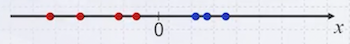
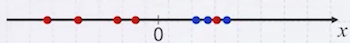
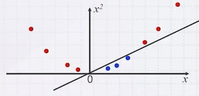
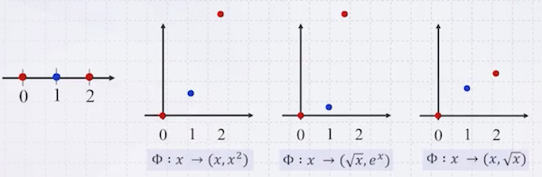
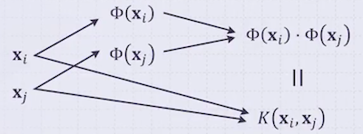

# 9 Support Vector Machine(2)

다음 세 가지 데이터 분포를 살펴보자.

| Example | Linearly Separable? |
| :---: | :---: |
|  | Yes |
|  | Yes(considering error) |
|  | **No** |

세 번째 예시는 linear 경계로 나눌 수 없다. 이럴 때는 non-linear 경계가 필요하며, 이를 위해서는 먼저 데이터를 고차원으로 매핑해야 한다.

---

## 9.1 Non-Linear SVM

다음은 1차원 점을 2차원으로 매핑한 예시다.

| |
| :---: |
|  |
| $\downarrow$ |
| $\Phi: \mathbf{x} \mapsto (\mathbf{x}, \mathbf{x}^2)$ |
| $\downarrow$ |
|  |

> 이렇게 찾은 경계를 다시 원래 1차원으로 보내면 곡선 형태가 된다. 

매핑 함수는 직접 다양하게 정의할 수 있다.

이때 얼마나 고차원으로 매핑해야 하는가에 대한 답은 수학적으로 증명되어 있다. 

- $n$ 개의 점이 있다면, $n-1$ 차원으로 매핑 시 무조건 직선 경계로 나눌 수 있다. 

> 여기서 $n-1$ 은 worst case에 해당한다.

---

### 9.1.1 Non-Linear SVM: Formulation

앞서 **Non-Linear SVM**을 수식으로 표현해 보자.

- given $D = \{(\mathbf{x}_1, y_1), (\mathbf{x}_2, y_2), \ldots, (\mathbf{x}_n, y_n)\}$ where $y_i \in \{-1, +1\}$

- mapping function $\Phi: \mathbf{x} \mapsto \Phi(\mathbf{x})$

이렇게 고차원으로 확장한 데이터를 대상으로 Linear SVM 수식을 적용한다.

$$ \arg\max_{a_1, \ldots, a_n} \sum_{i=1}^n a_i - \frac{1}{2} \sum_{i=1}^n \sum_{j=1}^n a_i a_j y_i y_j \langle \Phi(\mathbf{x}_i), \Phi(\mathbf{x}_j) \rangle $$

$$ \mathrm{subject\ to} \sum_{i=1}^n a_i y_i = 0 \quad 0 \le a_i \le C $$

수식에 대한 해는 다음과 같다.

$$ w = \sum_{i=1}^n a_i y_i \Phi(\mathbf{x}_i) $$

$$ b = y_k - w \cdot \Phi(\mathbf{x}_k) = y_k - \sum_{i=1}^n a_i y_i \langle \Phi(\mathbf{x}_i), \Phi(\mathbf{x}_k) \rangle $$

---

### 9.1.2 Example

다음 예시에 대해 Non-Linear SVM을 적용해 보자.

- $D = \{(1, 1, -1,), (2, 2, -1), (3, 1, -1), (1, 2, 1), (3,2,1)\}$

- $\Phi: (\mathbf{x}_1, \mathbf{x}_2) \mapsto (\mathbf{x}_1, \mathbf{x}_2, \mathbf{x}_1^2, \mathbf{x}_2^2, \mathbf{x}_1^3, \mathbf{x}_2^3, \mathbf{x}_1 \mathbf{x}_2, \mathbf{x}_1 \mathbf{x}_2^2, \mathbf{x}_1^2 \mathbf{x}_2)$

위 데이터를 고차원으로 매핑하면 다음과 같다.

$$ \Phi(D) = \begin{pmatrix} 1 & 1 & 1 & 1 & 1 & 1 & 1 & 1 & 1 & -1 \\ 2 & 2 & 4 & 4 & 8 & 8 & 4 & 8 & 8 & -1 \\ 3 & 1 & 9 & 1 & 27 & 1 & 3 & 3 & 9 & -1 \\ 1 & 2 & 1 & 4 & 1 & 8 & 2 & 4 & 2 & 1 \\ 3 & 2 & 9 & 4 & 27 & 8 & 6 & 12 & 18 & 1 \end{pmatrix} $$

$$ \arg\max_{a_1, \ldots, a_5} \sum_{i=1}^5 a_i - \frac{1}{2} \sum_{i=1}^5 \sum_{j=1}^5 a_i a_j y_i y_j ( \Phi(\mathbf{x}_i) \cdot \Phi(\mathbf{x}_j) ) $$

$$ \mathrm{subject\ to} \sum_{i=1}^5 a_i y_i = 0 \quad 0 \le a_i \le C $$

문제는 argmax 수식에서 내적에 해당하는 $\Phi(\mathbf{x}_i) \cdot \Phi(\mathbf{x}_j)$ 계산이다. **차원이 커질수록 내적에 필요한 계산량이 급격히 증가**한다.

> 예를 들어 1만 개 데이터셋 쌍에 대해 1만 차원으로 확장한다고 가정하면, 10000 \* 10000 쌍에 대한 내적으로 1조 번의 곱셈 연산이 필요하다.

---

## 9.2 Kernel Trick

Non-Linear SVM의 목표는 엄밀하게는, (mapping 자체가 아닌) mapping 후의 내적 값이다. 다음 예시를 보자.

- $\mathbf{x}_1 = (x_{11}, x_{12}) , \mathbf{x}_2 = (x_{21}, x_{22})$

- $\Phi(\mathbf{x}_1) = (1, \sqrt{3} x_{11}, \sqrt{3} x_{12}, \sqrt{3} x_{11}^2, \sqrt{3} x_{12}^2, x_{11}^3, x_{12}^3, \sqrt{6} x_{11} x_{12}, \sqrt{3} x_{11} x_{12}^2, \sqrt{3} x_{11}^2 x_{12})$

- $\Phi(\mathbf{x}_2) = (1, \sqrt{3} x_{21}, \sqrt{3} x_{22}, \sqrt{3} x_{21}^2, \sqrt{3} x_{22}^2, x_{21}^3, x_{22}^3, \sqrt{6} x_{21} x_{22}, \sqrt{3} x_{21} x_{22}^2, \sqrt{3} x_{21}^2 x_{22})$

둘을 내적하면 다음과 같다.

$$\Phi(\mathbf{x}_1) \cdot \Phi(\mathbf{x}_2) = 1 + 3 x_{11} x_{21} + 3 x_{12} x_{22} + 3 x_{11}^2 x_{21}^2 + 3 x_{12}^2 x_{22}^2 + x_{11}^3 x_{21}^3 + x_{12}^3 x_{22}^3 + 6 x_{11} x_{12} x_{21} x_{22} + 3 x_{11} x_{12}^2 x_{21} x_{22}^2 + 3 x_{11}^2 x_{12} x_{21}^2 x_{22} $$

$\quad = ((x_{11} x_{21} + x_{12} x_{22}) + 1)^3$

$\quad = (\mathbf{x}_1 \cdot \mathbf{x}_2 + 1)^3$

변환 후의 내적 값을 보면, 변환 식은 보이지 않고 원래의 벡터 데이터만 남는다. 즉, 고차원으로 보내는 수식만 잘 정의하면, 내적 값을 바로 구할 수 있다. 이를 **Kernel Trick** 이라고 한다.

> 이미 잘 알려진 커널 함수가 많이 존재한다. 

---

### 9.2.1 Definition of Kernel

고차원으로 확장한 두 feature vector의 내적에 대응하는 함수 $K$ 를 **kernel**이라고 한다.

> kernel 개념은 사용한 대표적인 기법은 SVM이 있으며, 이러한 기법들을 kernel machine이라고 부른다.

---

### 9.2.2 Final Formulation of SVM

다음이 kernel trick을 적용한 SVM 수식이다.

$$ \arg\max_{a_1, \ldots, a_n} \sum_{i=1}^n a_i - \frac{1}{2} \sum_{i=1}^n \sum_{j=1}^n a_i a_j y_i y_j K(\mathbf{x}_i, \mathbf{x}_j) $$

$$ \mathrm{subject\ to} \sum_{i=1}^n a_i y_i = 0 \quad 0 \le a_i \le C $$

해는 다음과 같다.

$$ w = \sum_{i=1}^n a_i y_i \Phi(\mathbf{x}_i) $$

$$ b = y_k - \sum_{i=1}^n a_i y_i K(\mathbf{x}_i, \mathbf{x}_k) $$

> (Prediction) unknown x를 대상으로는 다음과 같이 예측할 수 있다.
>
> class of $\mathbf{x} = \begin{cases} +1 & \text{if } y(\mathbf{x}) \ge 0 \\ -1 & \text{otherwise} \end{cases}$
>
> where $y(\mathbf{x}) = \sum_{i=1}^n a_i y_i K(\mathbf{x}_i, \mathbf{x}) + b$

---

### 9.2.3 Some More on Kernels

대표적인 kernel 5개를 살펴보자. (Linear, Gaussian이 가장 많이 사용된다.)

| Kernel | Formula |
| --- | --- |
| **Linear Kernel** | $K(\mathbf{x}_i, \mathbf{x}_j) = \mathbf{x}_i \cdot \mathbf{x}_j$ |
| **Homogeneous Polynomial Kernel** | $K(\mathbf{x}_i, \mathbf{x}_j) = (\mathbf{x}_i \cdot \mathbf{x}_j + c)^d$ |
| **Polynomial Kernel** | $K(\mathbf{x}_i, \mathbf{x}_j) = (\mathbf{x}_i \cdot \mathbf{x}_j)^d$ |
| **Gaussian (RBF) Kernel** | $K(\mathbf{x}_i, \mathbf{x}_j) = \exp(-\frac{\|\|\mathbf{x}_i - \mathbf{x}_j\|\|^2}{2 \sigma^2})$ |
| **Sigmoid Kernel** | $K(\mathbf{x}_i, \mathbf{x}_j) = \tanh(\alpha \mathbf{x}_i \cdot \mathbf{x}_j + c)$ |

> $\sigma$ : 직접 정의 

조금 더 세부적으로 살펴보자.

- **Homogeneous Polynomial Kernel**

$$ \Phi(\mathbf{x}) = ( x_1^2, \sqrt{2} x_1 x_2, x_2^2 ) \quad  \Phi(\mathbf{y}) = ( y_1^2, \sqrt{2} y_1 y_2, y_2^2 ) $$

- **RBF Kernel**

$$ K(\mathbf{x}, \mathbf{y}) = \exp(-\frac{\|\mathbf{x} - \mathbf{y}\|^2}{2}) = \exp(-\frac{\mathbf{x} \cdot \mathbf{x}}{2}) \exp(-\frac{\mathbf{y} \cdot \mathbf{y}}{2}) \sum_{n=0}^{\infty} \frac{(\mathbf{x} \cdot \mathbf{y})^2}{n!} $$

일반적으로 RBF 커널을 많이 사용하는 이유는, 데이터를 모두 무한 차원으로 매핑한 뒤, 무한 차원에서 직선 경계를 찾기 때문이다.

---

## 9.3 Summary

다음은 SVM의 장단점을 요약한 내용이다.

- **장점**

  - 최적의 separating hyperplane을 찾는다.

  - 고차원 데이터 처리에 유리하다.

  - 일반적으로 잘 작동한다.

- **단점**

  - positive negative, multi-class 적용이 불가하다. (binary classification만 가능)

  - 좋은 커널 함수를 사용해야 한다.

  - 메모리 사용량 및 지연시간(CPU) 비용이 크다.

  - QP(Quadratic Problem)에서의 Lagrange multiplier: 수치 안정성 문제가 발생할 수 있다.

---