# 10 Random Forest

다음은 네 가지 알고리즘의 성능을 비교한 도표다.

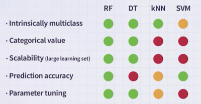

DT는 다양한 문제를 다룰 수 있지만, 정확도에서 불리한 경향이 있다. 이러한 단점을 개선하기 위한 방법으로 **Random Forest**가 등장하였다.

> SVM 역시 우수한 정확도를 갖지만, scalability에서 불리하므로 대규모 데이터셋에 적용하기 어렵다.

---

## 10.1 Ensemble

**ensemble**이란 학습 데이터에서 모델을 여러 개 만든 뒤, 이들의 결과를 종합하여 예측을 수행하는 방법이다.

- 각 모델의 정확도가 높으면서, correlation은 낮아야 한다.

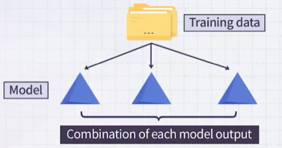

ensemble은 크게 두 가지 기법으로 나눌 수 있다.

---

### 10.1.1 Bagging

**bagging**은 n개의 모델에서 voting 혹은 averaging하여 예측한다. 다시 말해 모델은 모두 동등한 중요도를 가진다.

- 각 모델을 equivalent하게 취급한다.

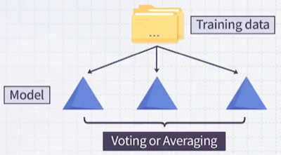

---

### 10.1.2 Boosting

**boosting**의 경우, 두 번째 모델은 첫 번째 모델에서 실수를 보완할 전문가를 둔다. 세 번째 모델은 앞서 두 모델을 합쳐도 여전히 부족한 부분을 보완할 전문가를 둔다.

- 즉, 각 모델을 직전 모델의 오류를 보완하는 전문가로 구성한다.

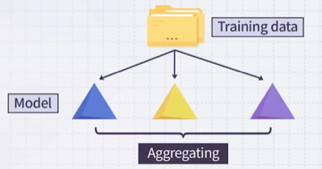

---

## 10.2 Bagging of Decision Trees

학습 데이터로 decision tree를 만든다면, 완전히 똑같은 correlation을 가진 트리가 생성된다. (ID3, C4.5 알고리즘 기준)

> 알고리즘이 고정되면 Decision Tree는 항상 동일한 구조를 가진다.

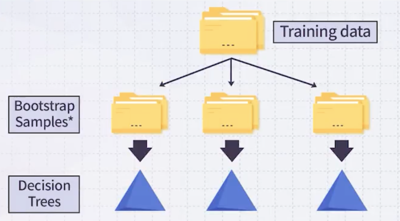

따라서, Bagging을 곧바로 적용하지 않고 **Bootstrap Sample** 기법을 활용한다. 이는 복원 추출 방식으로, 원본 데이터에서 중복을 허용하여 샘플을 추출하는 방법이다.

복원 추출 시 bootstrap sample의 크기는 원본 데이터와 동일하게 유지하며, 각 샘플은 독립적으로 선택한다.

> 예를 들어, 랜덤하게 복원 추출을 했으면 1번 데이터가 3번 들어가 있을 수 있고 2번 데이터는 아예 포함되지 않을 수도 있다.

결과적으로 bootstrap sample이 다르므로, 각 decision tree도 서로 다른 구조를 가지게 된다.

| 학습 데이터 | 단일 decision tree | Bagging |
| :---: | :---: | :---: |
| 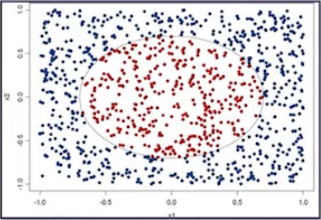 | 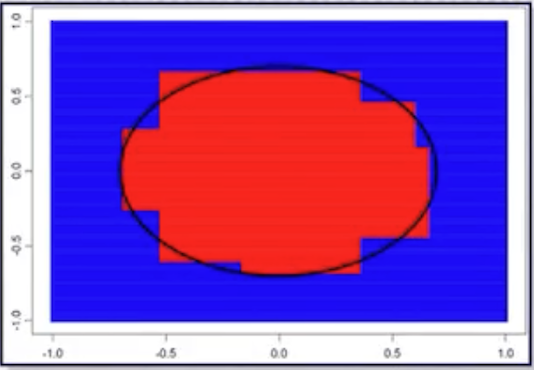 | 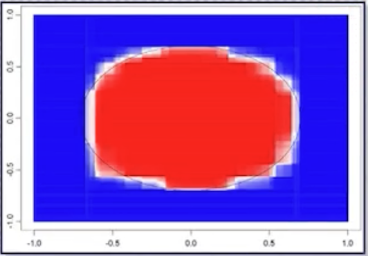 |

> **Notes**: bagging은 **bootstrap aggregating**의 줄임말이다. 예측의 variance를 낮추면서 성능을 향상시킬 수 있다.

---

## 10.3 Random Forests

**Random Forests**는 bagging of decision tree에 **additional randomness**를 추가한 기법이다. (decision tree가 많으므로 forest)

다음은 bootstrap sample로 생성한 x1부터 x9까지의 decision tree이다.

- bagging of DT: 이때 x1부터 x9까지 maximum entropy를 계산한 다음, $?$ 자리에 maximum gain을 갖는 입력을 넣는다.

- random forest: **무작위로 선택**한 입력(e.g., x1, x3, x4, x7) 중에서 maximum gain을 갖는 입력을 넣는다.

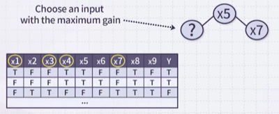

성능은 감소하더라도 (1) DT의 correlation이 감소하고, (2) DT의 생성 속도가 빨라진다는 장점을 갖는다. (SVM이나 딥러닝에 비해서도 빠른 속도)

> $N_{trees}$ : 생성할 DT의 개수, $m_{try}$: 각 split마다 선택할 feature 수

> 제한적이지만 interpretable하다는 장점도 갖는다.

대체로 tree를 많이 생성할수록 우수한 결정 경계를 형성할 수 있다.

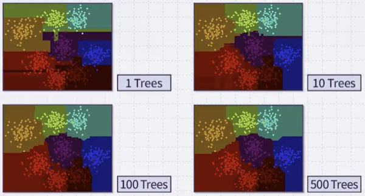

> Random Forest는 비교적 overfitting에 강건하다.

---

## 10.4 Out-Of-Bag

예를 들어 $n$ 개의 데이터를 뽑을 때(bootstrap sampling), 특정 데이터가 한 번도 안 뽑힐 확률은 다음과 같다.

$$ \lim_{n \to \infty} \left( 1 - \frac{1}{n} \right)^n = e^{-1} $$

$n$ 을 무한대로 보낼 때, 수학적으로 대략 35% 정도로 특정 데이터가 한 번도 안 뽑힐 수 있다. 여기서 bootstrap sample에 포함되지 않은 샘플을 **Out-Of-Bag**(OOB)이라고 부른다.

> 가령 100개 데이터를 뽑는다면, 35개 정도는 포함되지 않을 수 있다.

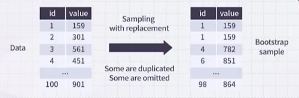

---

### 10.4.1 Out-Of-Bag Error

일반적으로 classifier 성능을 평가할 때, 대체로 학습과 테스트 데이터셋을 분할하여 활용하는 방법을 사용한다. (데이터는 귀중하다.)

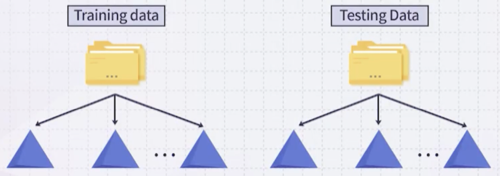

반면, random forest에서는 데이터를 분할 없이, **Out-Of-Bag Error**를 사용해 성능을 평가할 수 있다.

- Bootstrap sample에 포함되지 않은 데이터(OOB) = 학습에서 사용되지 않은 데이터

즉, OOB 데이터가 자연스럽게 테스트 데이터 역할을 한다.

> test dataset 성능과 OOB Error 성능을 비교하는 것은 불공정하므로 주의해야 한다.

다음은 Bootstrap sample에서 얻은 OOB 테이블 예시를 나타낸다. 동일한 OOB인 데이터를 갖는 sub-forest 단위로 성능을 평가한다.

- 첫 번째, 세 번째 tree: 공통적으로 OOB인 1번 데이터 활용

- 두 번째, 네 번째 tree: 공통적으로 OOB인 2번 데이터 활용

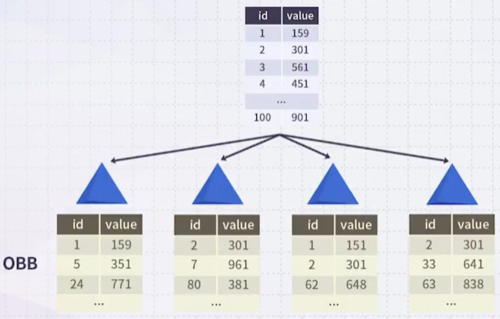

> 전체 tree 기준으로 어느 데이터가 OOB로 포함되지 않을 확률은 거의 0에 가깝다.

---

### 10.4.2 Variable Importance

$x_1$ 부터 $x_5$ 까지 입력을 갖는 다음 예시에서 **variable importance**를 평가해 보자. $y$ 를 예측하는 데 어떤 $x$ 가 가장 중요하고, 어떤 $x$ 가 덜 중요한지 확인할 수 있다.

- **variable importance**(k) = 모든 DT에서 구한 $\hat{e_k} - \hat{e}$ 의 평균

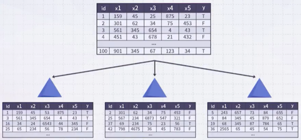

> 아래쪽 도표: OOB 데이터를 나타낸다.

**(1)** 먼저 첫 번째 tree에서 OOB를 활용해 성능을 평가한다. ( $\hat{e}$ )

**(2)** 만약 에러율이 5%가 나왔고 $x_1$ 중요도를 평가하고 싶다면, OOB 샘플에서 $x_1$  값을 randomly shuffling한 뒤 다시 성능을 평가한다. ( $\hat{e_k}$ )

> randomly shuffling 이후에도 에러율이 5%라면, $x_1$ 은 중요하지 않다고 판단한다. (shuffling 전후 에러율 차이를 계산)

**(3)** 다음 tree에서도 동일한 과정을 반복한다.

**(4)** 모든 tree에서 에러율 차이( $\hat{e_k} - \hat{e}$ )를 구한 뒤, tree 개수로 평균을 내면 **variable importance**를 평가할 수 있다.

> $x_5$ 의 에러율 차이가 평균 20이고 $x_1$ 의 차이가 평균 10이라면, $x_5$ 가 $y$ 예측에 더 중요하다고 판단할 수 있다.

---