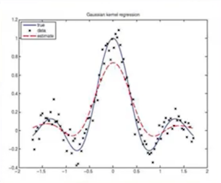
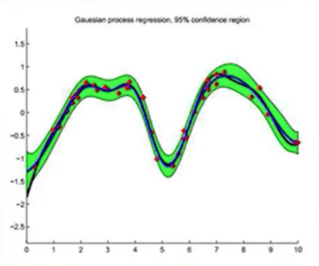
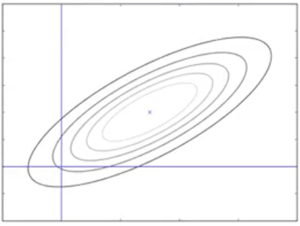
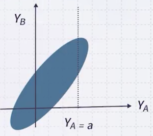
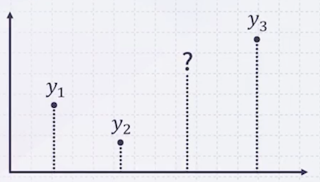
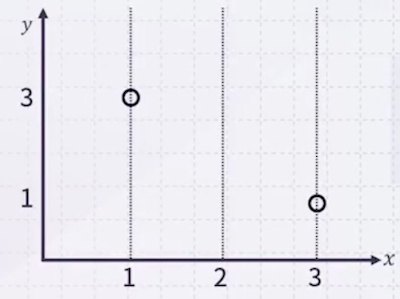
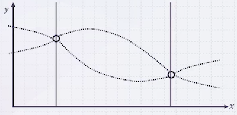
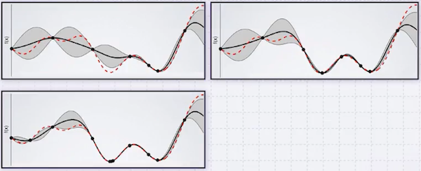

# 12 Gaussian Process

**Gaussian Process**는 회귀(Regression) 문제를 풀기 위한 Bayesian 기반 방법론이다.

| Kernel Regression (Non-Parametric, Non-Bayes) | **GP Regression** (Non-Parametric, Bayes) |
| :---: | :---: |
|  |  |

일반적으로 regression은 점 추정(unknown x에 대한 y 값이 무엇일까?)이다. 그런데 GP는 점 추정이 아닌 구간 추정(y가 취할 수 있는 값의 확률 분포)에 해당하는 개념이다.

$$ f(x) = \sum_{i=1}^N w_i(x) y_i $$

$$ w_i (x) \triangleq \frac{{\kappa}_h (x - x_i)}{\sum_{j=1}^N {\kappa}_h (x - x_j)} $$

> 함수의 분포를 알기 때문에, 예측 값의 **confidence**를 구할 수 있다.

---

## 12.1 Gaussian Distribution

**Gaussian Distribution**(정규 분포)을 복습해 보자.

$$ X \sim \mathcal{N}(\boldsymbol{\mu}, \boldsymbol{\Sigma}) $$

평균 값에서 거리가 멀어질수록 확률이 줄고, 이에 대한 분산( 공분산 행렬 $\boldsymbol{\Sigma}$ )이 존재한다. Gaussian distribution의 확률 밀도 함수(PDF)는 다음과 같다.

$$ f(\boldsymbol{x}) = \frac{1}{(2\pi)^{m/2} ||\boldsymbol{\Sigma}||^{1/2}} \exp \left( -\frac{1}{2} (\boldsymbol{x} - \boldsymbol{\mu}) \boldsymbol{\Sigma}^{-1} (\boldsymbol{x} - \boldsymbol{\mu})^{T} \right) $$

> **Notes**: Covariance
>
> 공분산은 두 개의 축(변수) X, Y 사이의 관계를 나타내는 척도로, XY의 평균 - X의 평균 * Y의 평균으로 정의한다.
>
> $\mathrm{cov}(X, Y) = \sigma_{XY}^2 = E(XY) - \mu_X {\mu}_Y$
>
> $\quad = E[(X - \mu_X)(Y - \mu_Y)] = \frac{1}{2} \sum_{i=1}^n (X_i - \mu_X)(Y_i - \mu_Y)$

이렇게 모든 축에 대한 공분산을 행렬로 묶은 것이 **covariance matrix**(공분산 행렬)이다.

- $\sigma_{i, j} = \sigma_{X_i, X_j}$ 이며, $\sigma_{i, j} = \sigma_{j, i}$ 과 같이 대칭 행렬이다.

$$ \Sigma = \begin{bmatrix} 
\sigma_{1,1}^2 & \sigma_{1,2}^2 & \cdots & \sigma_{1,k}^2 \\ 
\sigma_{2,1}^2 & \sigma_{2,2}^2 & \cdots & \sigma_{2,k}^2 \\
\vdots & \vdots & \ddots & \vdots \\ 
\sigma_{k,1}^2 & \sigma_{k,2}^2 & \cdots & \sigma_{k,k}^2
\end{bmatrix} $$

> (첫 번째 축, 첫 번째 축), (첫 번째 축, 두 번째 축), ..., (첫 번째 축, k번째 축) 이후 (두 번째 축, 첫 번째 축), (두 번째 축, 두 번째 축), ..., (두 번째 축, k번째 축), ...

---

### 12.1.1 Covariance Matrix

다음은 다양한 모양의 공분산 행렬을 나타낸 예시다.

1. 원 모양(diagonal)

$$ \Sigma = \begin{bmatrix}
\sigma^2 & 0 & \cdots & 0 \\
0 & \sigma^2 & \cdots & 0 \\
\vdots & \vdots & \ddots & \vdots \\
0 & 0 & \cdots & \sigma^2
\end{bmatrix} $$

2. 타원 모양(diagonal)

$$ \Sigma = \begin{bmatrix}
\sigma_{1,1}^2 & 0 & \cdots & 0 \\
0 & \sigma_{2,2}^2 & \cdots & 0 \\
\vdots & \vdots & \ddots & \vdots \\
0 & 0 & \cdots & \sigma_{k,k}^2
\end{bmatrix} $$

3. 회전한 타원 모양

$$ \Sigma = \begin{bmatrix}
\sigma_{1,1}^2 & \sigma_{1,2}^2 & \cdots & \sigma_{1,k}^2 \\
\sigma_{2,1}^2 & \sigma_{2,2}^2 & \cdots & \sigma_{2,k}^2 \\
\vdots & \vdots & \ddots & \vdots \\
\sigma_{k,1}^2 & \sigma_{k,2}^2 & \cdots & \sigma_{k,k}^2
\end{bmatrix} $$

이때 공분산은 correlation과 관련이 있지만, 언제나 관계가 성립하지는 않는다. ('**normalized** covariance가 correlation이다'로 기억하자.)

다음은 $Y_A, Y_B$ 두 축을 갖는 Gaussian distribution 예시다. 평균과 공분산 행렬은 다음과 같다.

$$ \begin{pmatrix} Y_A \\ Y_B \end{pmatrix} \sim \mathcal{N} \left( \begin{pmatrix} \boldsymbol{\mu_A} \\ \boldsymbol{\mu_B} \end{pmatrix}, \begin{pmatrix} K_{AA} & K_{AB} \\ K_{BA} & K_{BB} \end{pmatrix} \right) $$

이러한 분포를 바탕으로 구간 추정, 즉 regression과 유사한 작업이 가능하다.

- 예를 들면, $Y_A$ 가 a라는 값을 가질 때, $Y_B$ 는 어떤 값을 가질지 예측할 수 있다.

  

> 파란색: $Y_B$ 가 존재할 수 있는 구간 (단, 확률적인 구간이기 때문에 바깥에 점이 있을 수도 있다)

이처럼 주어진 Gaussian distribution이 있을 때 $Y_A$ 값을 알고 있다면, $P(Y_B | Y_A)$ 는 Gaussian distribution이다.

$$ P(Y_B | Y_A) = \mathcal{N}(\boldsymbol{\mu}, \boldsymbol{\Sigma}) $$

$$ \boldsymbol{\mu} = \boldsymbol{\mu_B} + \boldsymbol{K_{BA}} \boldsymbol{K_{AA}}^{-1} (Y_A - \boldsymbol{\mu_A}) $$

$$ \boldsymbol{\Sigma} = \boldsymbol{K_{BB}} - \boldsymbol{K_{BA}} \boldsymbol{K_{AA}}^{-1} \boldsymbol{K_{AB}} $$

---

## 12.2 Gaussian Process

어떠한 함수 $y=f(x)$ 가 있지만 해당 함수를 모른다고 하자. 이때 $x_1$ 일 때 $y_1$, $x_2$ 일 때 $y_2$ , $x_3$ 일 때 $y_3$ 은 관측하였다. 

> linear regression와 같은 다양한 회귀 기법을 통해 함수를 추정할 수 있다. 지금은 Gaussian Process(GP)를 통해 함수를 추정해 볼 것이다.

GP 추정을 위해 다음을 먼저 가정해야 한다.

- $(y_1, y_2, y_3, y)$ 가 Gaussian distribution을 따른다.

- 평균과 공분산 행렬을 안다.

  - 평균: 일반적으로 0으로 가정( $y_1$ 의 평균도 0, $y_2$ 의 평균도 0, $y_3$ 의 평균도 0, $y$ 의 평균도 0 )

  - 공분산: $x_1$ 과 $x_2$ 가 가까워질수록 $f(x_1)$ 과 $f(x_2)$ 공분산은 커지고, 멀어질수록 작아진다고 가정

    (위 가정에 부합하는 함수를 정의하여 공분산으로 사용한다.)

$$ \exp \left( -\frac{||x_1 - x_2||_2^2}{l^2} \right) $$

> $y$ 값이 random variable이며 임의의 모든 값을 가지므로, 평균을 0으로 가정하는 것은 타당하다.

---

### 12.2.1 Example 1

$f(1)=3, f(3)=1$ 일 때, $f(2)$ 를 추정해야 한다.

이를 $y_1 = 3, y_2 = 1$ 로 두고 $y$ 를 추정할 것이다. 평균과 공분산 행렬은 다음과 같다.

$$ \begin{pmatrix}  y_1 \\ y_2 \\ y \end{pmatrix} = \mathcal{N} \left( \begin{pmatrix} 0 \\ 0 \\ 0 \end{pmatrix}, \begin{pmatrix} 1 & e^{-4} & e^{-1} \\ e^{-4} & 1 & e^{-1} \\ e^{-1} & e^{-1} & 1 \end{pmatrix} \right) $$

구하고 싶은 값은 $P(y | y_1=3, y_2=1) = \mathcal{N}(\boldsymbol{\mu}, \boldsymbol{\Sigma})$ 이다.

$$ \boldsymbol{\mu} = \begin{pmatrix} 0 \end{pmatrix} + \begin{pmatrix} e^{-1} & e^{-1} \end{pmatrix} \begin{pmatrix} 1 & e^{-4} \\ e^{-4} & 1 \end{pmatrix}^{-1} \begin{pmatrix} 3 - 0 \\ 1 - 0 \end{pmatrix} = 1.445 $$

$$ \boldsymbol{\Sigma} = 1 - \begin{pmatrix} e^{-1} & e^{-1} \end{pmatrix} \begin{pmatrix} 1 & e^{-4} \\ e^{-4} & 1 \end{pmatrix}^{-1} \begin{pmatrix} e^{-1} \\ e^{-1} \end{pmatrix} = 0.734 $$

즉, 평균으로 약 1.4를 갖는 Gaussian 함수로 추정한 것이다.

---

### 12.2.2 Example 2

더 많은 지점의 값을 알수록 $f(x)$ 를 보다 잘 추정할 수 있다.

> 빨간색: 원래 함수, 검은 점: 관측한 값, 회색 영역: GP가 추정한 함수가 존재할 수 있는 범위

주의해야 할 점은 covariance 함수로, 해당 함수가 바뀌면 추정하는 함수도 달라지게 된다. (사용자가 잘 선택해야 한다.)

---

## 12.3 Summary

GP는 joint Gaussian distribution으로 정의되며, $y_1, y_2, \cdots, y_n$ 이 Gaussian distribution을 따른다고 가정한다.

- Given Training Data $D = \{(x_1, y_1), (x_2, y_2), \cdots, (x_N, y_N)\}$

- Test Data $D_\ast = \{(\alpha_1, \beta_1), (\alpha_2, \beta_2), \cdots, (\alpha_{N_\ast}, \beta_{N_\ast})\}$

이때 평균이 0이며 분산에 대한 함수는 kernel $\kappa$ 로 주어진다고 하면, **Posterior Gaussian Process**를 정의할 수 있다.

- **Assumption**

$$ \begin{pmatrix} \boldsymbol{Y} \\ \boldsymbol{Y_\ast} \end{pmatrix} \sim \mathcal{N} \left( \begin{pmatrix} 0 \\ 0 \end{pmatrix}, \begin{pmatrix} \kappa(X, X) & \kappa(X, X_\ast) \\ \kappa(X_\ast, X) & \kappa(X_\ast, X_\ast) \end{pmatrix} \right) $$

- **Posterior GP**

$$ P(\boldsymbol{Y_\ast} | \boldsymbol{Y}, X, Y) = \mathcal{N}(\boldsymbol{\mu_\ast}, \boldsymbol{\Sigma_\ast}) $$

$$ \boldsymbol{\mu_\ast} = \kappa(X_\ast, X) \kappa(X, X)^{-1} \boldsymbol{Y} $$

$$ \boldsymbol{\Sigma_\ast} = \kappa(X_\ast, X_\ast) - \kappa(X_\ast, X) \kappa(X, X)^{-1} \kappa(X, X_\ast) $$

---