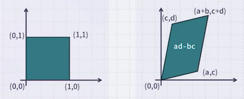
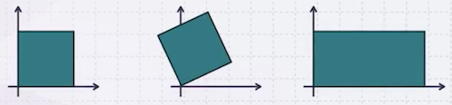
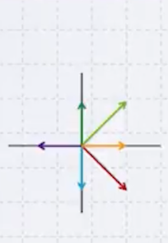

# 13 Matrix Factorization

---

## 13.1 Matrix vs. Linear Transformation

다음은 $(x, y)$ 를 $(ax+by, cx+dy)$ 의 새로운 공간으로 보내는 mapping 예시다.

이러한 변환 행렬은 정사각형을 사다리꼴로 변형시키는 것을 볼 수 있다. 이외에도 Linear tranform은 회전 변환이나 stretching도 가능하다.

$$ \begin{pmatrix} a & b \\ c & d \end{pmatrix} \begin{pmatrix} x \\ y \end{pmatrix} = \begin{pmatrix} X \\ Y \end{pmatrix} $$

- **rotation**

$$ \begin{pmatrix} \cos \theta & -\sin \theta \\ \sin \theta & \cos \theta \end{pmatrix} \begin{pmatrix} x \\ y \end{pmatrix} = \begin{pmatrix} X \\ Y \end{pmatrix} $$

- **stretching**

$$ \begin{pmatrix} s_x & 0 \\ 0 & s_y \end{pmatrix} \begin{pmatrix} x \\ y \end{pmatrix} = \begin{pmatrix} X \\ Y \end{pmatrix} $$

---

## 13.2 Eigenvalues, Eigenvectors

다음은 여러 벡터에 linear transform를 적용한 전과 후를 비교한 그림이다.

$$ \begin{pmatrix} 2 & 1 \\ 1 & 2 \end{pmatrix} \begin{pmatrix} x \\ y \end{pmatrix} = \begin{pmatrix} X \\ Y \end{pmatrix} $$

| 변환 전 | 변환 후 |
| :---: | :---: |
|  |  |

초록색과 빨간색 벡터는 변환 후 방향이 변하지 않았다. 이러한 벡터를 **eigenvector**라고 한다. 이때 바뀌는 길이에 해당하는 값을 **eigenvalue**라고 한다.

$$ A \mathbf{x} = \lambda \mathbf{x} $$

> eigenvector는 모두 **수직**으로 만난다.

$n$ 개의 eigenvalues가 있고, 대응하는 $n$ 개의 (normalized) eigenvectors가 있다고 하자.

- $\lambda_1, \lambda_2, \cdots, \lambda_n$: eigenvalues

- eigenvectors

$$ \lambda_1 \rightarrow \boldsymbol{v_1} = \begin{pmatrix} v_{11} \\ v_{21} \\ \vdots \\ v_{n1} \end{pmatrix}, \quad \lambda_2 \rightarrow \boldsymbol{v_2} = \begin{pmatrix} v_{12} \\ v_{22} \\ \vdots \\ v_{n2} \end{pmatrix}, \quad \cdots, \quad \lambda_n \rightarrow \boldsymbol{v_n} = \begin{pmatrix} v_{1n} \\ v_{2n} \\ \vdots \\ v_{nn} \end{pmatrix} $$

임의의 행렬(linear transform)에 대해 eigenvector, eigenvalue를 구할 것이다.

$$ \begin{pmatrix} 2 & 1 \\ 1 & 2 \end{pmatrix} \begin{pmatrix} x \\ y \end{pmatrix} = \lambda \begin{pmatrix} x \\ y \end{pmatrix} $$

변환 후 벡터의 방향은 바뀌지 않고 길이만 바뀌므로, 다음과 같은 식을 풀이하면 된다.

$$ \begin{pmatrix} 2 & 1 \\ 1 & 2 \end{pmatrix} \begin{pmatrix} x \\ y \end{pmatrix} - \lambda \cdot \mathbf{I} \begin{pmatrix} x \\ y \end{pmatrix} = 0 $$

$$  \begin{pmatrix} 2 - \lambda & 1 \\ 1 & 2 - \lambda \end{pmatrix} \begin{pmatrix} x \\ y \end{pmatrix} = 0 $$

이러한 일차 연립방정식이 무한히 많은 해를 가지려면, determinant가 0이어야 한다.

$$ \det \begin{pmatrix} 2 - \lambda & 1 \\ 1 & 2 - \lambda \end{pmatrix} = (2 - \lambda)^2 - 1 = 0 $$

$$ \lambda = 3, \quad (x, y) = (t, t) $$

$$ \lambda = 1, \quad (x, y) = (t, -t) $$

> eigenvector는 방향만 의미하기 때문에 $(t,t)$ 과 같이 표기한다. (편의상 길이가 1인 unit vector로 주로 표현)

다음은 주요 eigenvalue, eigenvector의 성질이다.

1. Eigenvector는 서로 직교한다.

2. $A$ 가 $n \times n$ 행렬이면, $n$ 개의 eigenvalue와 eigenvector를 가진다. (이때 eigenvalue가 0일 수 있다.)

3. $A$ 가 대칭행렬(symmetric matrix)이면, 모든 eigenvalue는 non-negative이다.

---

## 13.3 Singular Value Decomposition (SVD)

다음은 $n$ 개의 eigenvectors를 column으로 모은 $S$ 행렬이다.

$$ S = (\boldsymbol{v_1} \quad \boldsymbol{v_2} \quad \cdots \quad \boldsymbol{v_n}) = \begin{bmatrix} v_{11} & v_{12} & \cdots & v_{1n} \\ v_{21} & v_{22} & \cdots & v_{2n} \\ \vdots & \vdots & \ddots & \vdots \\ v_{n1} & v_{n2} & \cdots & v_{nn} \end{bmatrix} $$

- (normalized) eigenvector 길이가 1이므로, 각 column의 길이는 모두 1이다.

- eigenvector가 모두 수직이므로, 모든 column이 서로 직교한다.

따라서 $S$ 벡터는 orthogonal matrix이다. 즉, $S^T S = I$ 이다.

위 $S$ 를 행렬 $A$에 곱해보자.

$$ AS = A (\boldsymbol{v_1} \quad \boldsymbol{v_2} \quad \cdots \quad \boldsymbol{v_n}) = (A\boldsymbol{v_1} \quad A\boldsymbol{v_2} \quad \cdots \quad A\boldsymbol{v_n}) $$

$$ = (\lambda_1 \boldsymbol{v_1} \quad \lambda_2 \boldsymbol{v_2} \quad \cdots \quad \lambda_n \boldsymbol{v_n}) $$

$$ = (\boldsymbol{v_1} \quad \boldsymbol{v_2} \quad \cdots \quad \boldsymbol{v_n}) \begin{pmatrix} \lambda_1 & 0 & \cdots & 0 \\ 0 & \lambda_2 & \cdots & 0 \\ \vdots & \vdots & \ddots & \vdots \\ 0 & 0 & \cdots & \lambda_n \end{pmatrix} = S \Lambda $$

이처럼 대각선으로만 eigenvalue $\lambda$ 가 존재하는 $\Lambda$ 행렬로 decomposition된다. ( $AS = S \Lambda$ )

이때, $S$ 는 invertible하므로 다음과 같이 정리할 수 있다. 

$$ A = S \Lambda S^{-1} $$

$$ A = S \Lambda S^T $$

> **Notes**: 이처럼 정방 행렬은 은 이처럼 세 개의 행렬로 decomposition할 수 있다.

---

### 13.3.1 SVD for Non-square Matrix

수학적 증명이 다소 복잡하기 때문에, 직관적인 설명으로 대체할 것이다. 

- $A$ 가 정방행렬이 아니더라도, $A ^T A$ 와 $A A^T$ 는 정방행렬이 된다. (즉, decomposition 가능)

$$A^TA = V \Lambda_1 V^T, \quad AA^T = U \Lambda_2 U^T$$

- $C = U \Sigma V^T$ 라고 하자. ( where $\Sigma = \sqrt{\Lambda_1}$ )

  이에 대해 $C^TC$ 를 계산하면 다음과 같다.

$$ C^T C = (U \Sigma V^T)^T U \Sigma V^T = V \Sigma^T U^T U \Sigma V^T = V \Sigma^2 V^T = V \Lambda_1 V^T = A^T A $$

- $C$ 값은 $A$ 와 동일하다. (자세한 증명은 생략)

정리하자면, $A$ 는 $U \Sigma V^T$ 형태로 분해할 수 있다. 이때의 sigma 행렬을 **singular value**라고 지칭한다.

---