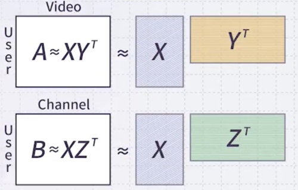

# 13 Matrix Factorization

> GPU를 활용한 병렬화가 용이하다.

---

## 13.4 Matrix Factorization Formulation

어떤 행렬 $R$ 을, 두 개의 행렬 곱( $R'=U \times V$ )으로 근사하는 기법을 **Matrix Factorization**이라고 한다.

- **오차** (주로 경사 하강법으로 최적화)

$$ E(U, V) = \sum_{m, n} (R_{mn} - R'_{mn})^2 $$

오차를 최소화할 때, 일반적으로 기계 학습의 **regularization** 항을 추가한다.

- $U$ , $V$ 가 최대한 희소하도록 정규화

$$ \underset{U, V}{\arg \min} E(U, V) = \sum_{m, n} (R_{mn} - R'_{mn})^2 + \lambda \left( \sum_{m,p} U_{mp}^2 + \sum_{p,n} V_{pn}^2 \right) $$

> Linear Algebra로 표현하면 다음과 같다. (L2 norm)
>
> $$ \underset{U, V}{\arg \min} E(U, V) = ||R-R'||_F^2 + \lambda (||U||_F^2+||V||_F^2) $$

---

### 13.4.1 Solve with Gradient Descent

경사 하강법을 사용하여 $U$와 $V$를 업데이트할 수 있다.

<table>
<tr>
<td>

**Algorithm**

</td>
</tr>
<tr>
<td>

*for t = 1 to infinite*

{

$\quad$ *for all m and p*, $U_{mp}^{t+1} = U_{mp}^t - \lambda \left( \frac{\partial E(U,V)}{\partial U_{mp}} \right)_{U_{mp}=U_{mp}^t}$

$\quad$ *for all p and n*, $V_{pn}^{t+1} = V_{pn}^t - \lambda \left( \frac{\partial E(U,V)}{\partial V_{pn}} \right)_{V_{pn}=V_{pn}^t}$

}

</td>
</tr>
</table>

---

## 13.5 Matrix Factorization Variations

기본 형태는 다음과 같다.

- R을 근사하는 $U$ , $V$ 탐색

$$ r_{u, i} \approx u_u \bullet v_i $$

다음은 학습 파라미터 $b_u, b_i$ (bias)를 포함하는 variation이다.

> 예를 들어, 영화 점수를 사람별로 매긴 행렬이 있다면, 사람 A행 B행 C행마다 bias가 다르게 존재해야 한다.

- 다음을 근사하는 $P$ , $Q$ 탐색

$$ r_{u, i} \approx \mu + b_u + b_i + p_u \bullet q_i $$

- 다음을 근사하는 (평균 $\mu$ 를 제외한) $b_u$, $b_i$, $p_u$, $q_i$ 탐색

$$ r_{u, i} \approx \mu + b_u + b_i + p_u \bullet q_i $$

예를 들어 마지막 수식의 target function은 다음과 같다.

$$ \min_{b_{\ast}, p_{\ast}, q_{\ast}} \sum_{(u,i) \in \mathcal{R}} (r_{u,i} - (\mu + b_u + b_i + p_u \bullet q_i))^2 + \lambda (b_u^2 + b_i^2 + ||p_u||^2 + ||q_i||^2) $$

> **Notes**: 미분 수식
>
> - $b_u \leftarrow b_u + \eta (e_{u,i} - \lambda b_u)$
>
> - $b_i \leftarrow b_i + \eta (e_{u,i} - \lambda b_i)$
>
> - $p_u \leftarrow p_u + \eta (e_{u,i} \cdot p_u - \lambda q_i)$
>
> - $q_i \leftarrow q_i + \eta (e_{u,i} \cdot q_i - \lambda p_u)$

---

### 13.5.1 Collective Matrix Factorization

다음은 주로 추천 도메인에서 사용하는 **collective matrix factorization**의 예시다. 

- 어떤 유저가 영화를 고르는 선호도와, TV 채널을 고르는 선호도는 유사할 것이다.

두 데이터에서, user factor $X$ 를 공유하는 조건으로 손실 함수를 modeling한다.

$$ L(X, Y, Z) = \frac{1}{2} ||I_1 \circ (A -XY^T) ||_F^2 + \frac{\alpha}{2} \circ || B - XZ^T ||_F^2 + \frac{\beta}{2} (||X||_F^2 + ||Y||_F^2 + ||Z||_F^2 ) $$

---