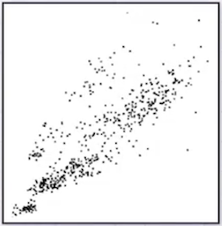
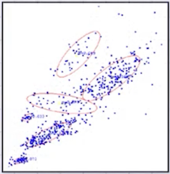
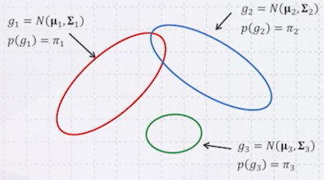
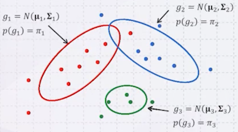
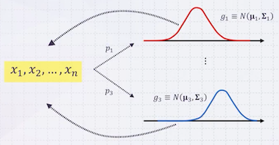
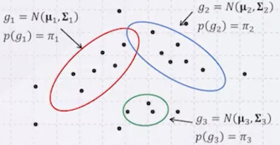
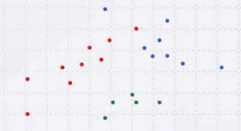
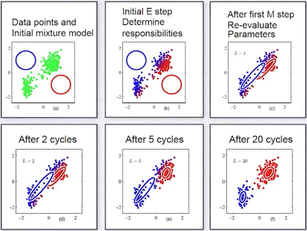

# 14 Gaussian Mixture Model

**Gaussian Mixture Model**(GMM)은 Unsupervised 기법 중 하나이며, Clustering의 확률적 접근 방식이다.

---

## 14.1 Gaussian Mixture Model

먼저 대표적인 클러스터링 기법인 k-means는 경계를 넘어가면 바로 다른 클러스터에 속하게 된다. 반면 GMM은 soft한 경계를 갖는데, 예를 들어 어떤 경계에 속할 확률을 0.3, 다른 경계에 속할 확률을 0.7으로 볼 수 있다.

|  | GMM |
| :---: | :---: |
|  |  |

위 예시처럼 GMM은 cluster로 타원 형태를 갖는다. (k-means는 원 형태)

---

### 14.1.1 Mixture of Gaussians: Example 1

먼저 간단한 예시를 몇 가지 살펴볼 것이다. 다음은 data generation으로, 3개의 Gaussian distribution이 있다고 하자. (평균, 분산은 알려져 있음)

- 3가지 Gaussian 중 하나를 임의로 골라서 생성하는 과정을 $n$ 회 반복 시 확률

$$ p(\boldsymbol{x}) = \sum_{i=1}^3 p(\boldsymbol{x} | g_i) p(g_i) $$

> $p(g_1), p(g_2), p(g_3)$ : 각 Gaussian이 선택될 확률

| | |
| :---: | :---: |
|  |  |

> 빨간색 점이 빨간 원을 벗어나 있지만, GMM은 soft한 경계를 갖기 때문에 얼마든지 가능하다.

> 

---

### 14.1.2 Mixture of Gaussians: Example 2

이번에는 3개의 Gaussian에서 생성한 데이터가 있지만, **각 Gaussian의 평균과 분산을 모른다**고 가정하자.

> 또한, 각 점이 **어떤 Gaussian에서 생성되었는지도 모른다.**

이러한 문제는 상당히 풀기 매우 어렵기 때문에, 가정을 추가하여 생각할 것이다.

> | **가정 1** | **가정 2** |
> | :---: | :---: |
> |  |  |

**가정 1**. 3개의 **Gaussian의 평균과 분산을 알고 있다.**

위 가정이 있다면, 각 점이 어떤 Gaussian에서 생성되었을 확률을 계산할 수 있다.

$$ z_{ki} = p(g_i | \boldsymbol{x}_k) = \frac{p(\boldsymbol{x}_k | g_i) p(g_i)}{p(\boldsymbol{x}_k)} $$

$$ = \frac{p(\boldsymbol{x}_k | g_i) p(g_i)}{\sum_{j=1}^3 p(\boldsymbol{x}_k | g_j) p(g_j)} $$

$$ = \frac{p(\boldsymbol{x}_k | g_i) \pi_i}{\sum_{j=1}^3 p(\boldsymbol{x}_k | g_j) \pi_j} $$

반면, 다음과 같은 가정도 가능하다.

**가정 2**. 각 점을 **어떤 Gaussian에서 생성했는지 알고 있다.**

이는 각 데이터를 바탕으로 각 Gaussian의 평균과 분산을 계산하면 된다.

$$ \mu_i = \frac{\sum_{j=1}^n p(g_i | \boldsymbol{x}_j) \cdot \boldsymbol{x}_j}{\sum_{j=1}^n p(g_i | \boldsymbol{x}_j)} $$

$$ \pi_i = \frac{\sum_{j=1}^n p(g_i | \boldsymbol{x}_j)}{n} $$

> **Summary**
> 
> - $\boldsymbol{\mu_i}, \sigma_i^2, \pi_i$ 를 안다면, $z_{ki} = p(g_i | \boldsymbol{x}_k)$ 를 구할 수 있다.
>
>     = Gaussian의 평균, 분산과 initial probability를 알면, 각 점이 어떤 Gaussian에서 생성되었는지 알 수 있다.
> 
> - $z_{ki} = p(g_i | \boldsymbol{x}_k)$ 를 안다면, $\boldsymbol{\mu_i}, \sigma_i^2, \pi_i$ 를 구할 수 있다.
>
>   = 각 점이 어떤 Gaussian에서 생성되었는지 알면, Gaussian의 평균, 분산을 알 수 있다.

---

### 14.1.3 Mixture of Gaussians: Example 3

그렇다면 둘 다 모르는 상황에서는 어떻게 해야 할까? 이는 하나를 **randomly initialize**하는 방법으로 해결할 수 있다.

1. $\boldsymbol{\mu_i}, \sigma_i^2, \pi_i$ 를 임의로 초기화

$$ \boldsymbol{\mu_1^0}, \boldsymbol{\Sigma_1^0}, \cdots, \boldsymbol{\mu_k^0}, \boldsymbol{\Sigma_k^0}, \pi_1^0, \cdots, \pi_k^0 $$

2. 위 $\boldsymbol{\mu_i}, \sigma_i^2, \pi_i$ 를 바탕으로,  $p(g_i | \boldsymbol{x}_j)$ 추정

$$ p(g_i | \boldsymbol{x}_j) = \frac{p(\boldsymbol{x}_j | g_i) \pi_i^t}{\sum_{c=1}^k p(\boldsymbol{x}_j | g_c) \pi_c^t} $$

$$ \mathrm{where} \quad p(\boldsymbol{x}_j | g_i) = \mathcal{N}(\boldsymbol{x}_j | \boldsymbol{\mu_i^t}, \Sigma_i^{t}) $$

3. 추정한 $p(g_i | \boldsymbol{x}_j)$ 를 바탕으로, $\boldsymbol{\mu_i}, \sigma_i^2, \pi_i$ 업데이트

$$ \boldsymbol{\mu_i^{t+1}} = \frac{\sum_{j=1}^n p(g_i | \boldsymbol{x}_j) \cdot \boldsymbol{x}_j}{\sum_{j=1}^n p(g_i | \boldsymbol{x}_j)} $$

$$ \boldsymbol{\Sigma_i^{t+1}} = \frac{\sum_{j=1}^n p(g_i | \boldsymbol{x}_j) \cdot (\boldsymbol{x}_j - \boldsymbol{\mu_i^{t+1}})^T \bullet (\boldsymbol{x}_j - \boldsymbol{\mu_i^{t+1}})}{\sum_{j=1}^n p(g_i | \boldsymbol{x}_j)} $$

$$ \pi_i^{t+1} = \frac{\sum_{j=1}^n p(g_i | \boldsymbol{x}_j)}{n} $$

$$ \mathrm{where} \quad \boldsymbol{x_k} = (x_{k1}, x_{k2}, \cdots, x_{kd}), \boldsymbol{\mu_i^t} = (\mu_{i1}^t, \mu_{i2}^t, \cdots, \mu_{id}^t) $$

위 2, 3번 과정을 반복하면서 원하는 지점에 도달할 때까지 진행하는 방법을 **Gaussian Mixture Model**이라고 한다.

> k-means도 유사하게 2, 3번 과정을 반복하는데, 평균만을 업데이트한다.

---

