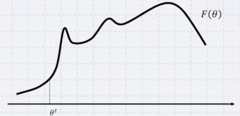
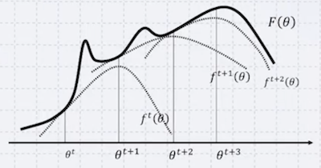
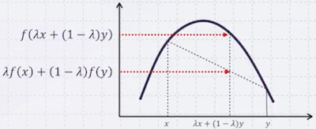
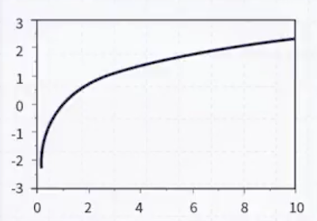
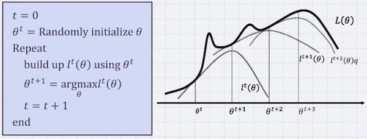
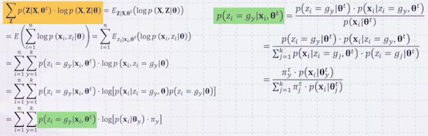

# 14 Gaussian Mixture Model

---

## 14.2 Expectation-Maximization Algorithm

**Expectation-Maximization**(EM) 알고리즘은 확률을 optimize, maximize하는 데 많이 사용되며, hidden variable이 존재하는 상황에서 maximum likelihood를 구할 때 사용한다.

> 예를 들어, 어떤 함수를 최대화하고 싶다면 EM 알고리즘을 사용할 수 있다. (gradient ascend와 매우 유사)

다음 $F(x)$ 목적함수에서 maximum을 찾고 싶다고 하자. 2번과 3번 과정을 반복하며 최대값을 찾을 수 있다. (주의: local optimum에 해당)

| | |
| :---: | --- |
|  | **1**. 임의의 point $\theta^t$ 선택 |
|  | **2**. 세 조건을 만족하는 함수 $f^t(\theta)$ 생성 - 위로 볼록(convex upper)  - $F(\theta) \ge f^t(\theta)$ for all $\theta$  - $F(\theta^t) = f^t(\theta^t)$ |
|  | **3**. $f^t$ 를 maximize하는 $\theta^{t+1}$ 선택  ( $\arg\max f^t(\theta)$ ) |

> $F(\theta^{t+1}) \ge F(\theta^t)$ 

> 2번 풀이: 목적함수 F보다 항상 같거나 작은데, $\theta^t$ 에서의 값은 F와 같다.

---

## 14.3 Background: Jensen's Inequality

**Jensen's Inequality**는 위로 볼록한 함수(convex function)에서 성립하는 부등식이다.

- $f(x)$ 가 위로 볼록할 경우

$$ \lambda f(x) + (1 - \lambda) f(y) \le f(\lambda x + (1 - \lambda) y) , \quad  \lambda \in [0, 1] $$

이는 다음과 같이 일반화할 수 있다.

$$ \sum_{i=1}^n \lambda_i f(x_i) \le f\left(\sum_{i=1}^n \lambda_i x_i\right) , \quad \sum_{i=1}^n \lambda_i = 1, \lambda_i \ge 0 $$

모두 합산했을 때 1이 되는 $\lambda$ 를 $p(x)$ 로 바꿔치면, 이를 **확률로 해석할 수 있다**.

$$ \sum_i^n p(x_i) f(x_i) \le f\left(\sum_i^n p(x_i) x_i\right) $$

> $f(x)$ 의 평균은, $x$ 의 평균을 $f$ 에 넣은 값보다 작거나 같다.

---

### 14.3.1 Logarithm and Jensen's Inequality

로그 함수 역시 위로 볼록한 함수이므로, Jensen's Inequality가 성립한다.

$$ \sum_{i=1}^n p(x_i) \log(x_i) \le \log\left(\sum_{i=1}^n p(x_i) x_i\right) $$

이때, $x_i$ 대신 양수인 함수 $f$ 를 넣어도 성립한다.

$$ \sum_x p(x) \log f(x) \le \log \sum_x p(x) f(x) $$

---

### 14.3.2 Likelihood with Hidden Variable

앞서 유도한 수식을 바탕으로 likelihood를 계산해 보자.

$$ L(\theta) = \log p(x | \theta) \quad \mathrm{for\ given\ } x $$

$$ = \log \sum_{z \in Z} p(x, z | \theta) p(z | \theta) $$

> 바게트 잘라먹기 적용. ( $z$ : hidden variables )

$$ = \log \sum_{z \in Z} \left[ p(x|z, \theta) p(z|\theta) \frac{p(z|x, \theta^t)}{p(z|x, \theta^t)} \right] $$

위 수식에서 내가 random하게 고른 $\theta^t$ 를 대입하면, $p(z|x, \theta^t)$ 는 상수가 된다. (즉, 분수 부분이 1이 된다.)  

식에 Jensen's Inequality를 적용하면 다음과 같다. (우변을 $l^t(\theta)$ 로 정의)

$$ \ge \sum_{z \in Z} \left[ p(z|x, \theta^t) \cdot \log \left( \frac{p(x|z, \theta) p(z|\theta)}{p(z|x, \theta^t)} \right) \right] = l^t(\theta) $$

이제 $l^t$ 를 상세하게 분석해 보자. ( $L(\theta^t) = l^t(\theta^t)$  증명 )

$$ l^t(\theta^t) = \sum_{z \in Z} \left[ p(z|x, \theta^t) \cdot \log \left( \frac{p(x|z, \theta^t) p(z|\theta^t)}{p(z|x, \theta^t)} \right) \right] $$

$$ = \sum_{z \in Z} \left[ p(z|x, \theta^t) \cdot \log \left( \frac{\frac{p(x, z|\theta^t)}{p(z|\theta^t)} p(z|\theta^t)}{p(z|x, \theta^t)} \right) \right] $$

$$ = \sum_{z \in Z} [ p(z|x, \theta^t) \cdot \log p(x, z|\theta^t) ] $$

$$ = \log p(x|\theta^t) \sum_{z \in Z} p(z|x, \theta^t) = p(x|\theta^t) $$

$$ = L(\theta^t) $$

결국 앞에서 말한 3가지 조건을 모두 만족한다.

---

## 14.4 Maximize Likelihood

이제 likelihood를 maximize하는 $\theta$ 를 찾는 문제로 돌아가 보자.

$$ \arg\max_\theta L(\theta) $$

EM Algorithm을 적용하면 다음과 같다.

> build up 부분을 **Expectation step (E-step)**, argmax 부분을 **Maximization step (M-step)** 라고 지칭한다.

이때 식은 다음과 같이 정리할 수 있었다.

$$ \arg\max_\theta \sum_{z \in Z} [ p(z|x, \theta^t) \cdot \log p (x, z|\theta) ] $$

---

## 14.5 GMM by EM Algorithm

이제 실제 GMM에 어떻게 적용되는지 살펴보자.

- 주어진 데이터 $\boldsymbol{X} = \{\boldsymbol{x}_1, \boldsymbol{x}_2, \ldots, \boldsymbol{x}_n\}$ 

- Gaussian $G = \{g_1, g_2, \cdots, g_k\}$

- Hidden $\boldsymbol{Z} = \{\boldsymbol{z}_1, \boldsymbol{z}_2, \cdots, \boldsymbol{z}_n\}$ 

$k$ 개의 Gaussian의 평균과 분산을 찾는 것이 목적이다. 이는 찾고 싶은 평균과 분산을 $\theta$ 로 정의한 뒤, EM 알고리즘을 적용하면 된다.

- $\boldsymbol{\theta} = \{\boldsymbol{\theta_1}, \boldsymbol{\theta_2}, \cdots, \boldsymbol{\theta_k}\} = \{(\boldsymbol{\mu_1}, \Sigma_1, \pi_1), (\boldsymbol{\mu_2}, \Sigma_2, \pi_2), \ldots, (\boldsymbol{\mu_k}, \Sigma_k, \pi_k)\}$

최종적으로 Maximization step에서 다음 문제를 풀이하면 된다.

$$ \boldsymbol{\theta^{t+1}} = \arg\max_{\theta} \sum_{i=1}^n \sum_{y=1}^k \left( \frac{\pi_y^t \cdot p(\boldsymbol{x_k}, \boldsymbol{\theta_y^t})}{\sum_{j=1}^k \pi_j^t \cdot p(\boldsymbol{x_k}, \boldsymbol{\theta_j^t})} \right) \cdot \log \left( \pi_y \cdot p(\boldsymbol{x_k}, \boldsymbol{\theta_y}) \right)  $$

$$ \mathrm{with\ a\ constraint\ } \sum_{y=1}^k \pi_y = 1 $$

> 이는 $\pi_y = 1$ 조건을 만족할 때 argmax 해를 찾는 것으로, constrained optimization, SVM에서 본 문제와 유사하다. 

위 식은 Lagrange multiplier를 통해 쉽게 풀이할 수 있다. 해의 형태는 다음과 같다.

$$ \boldsymbol{\mu_i^{t+1}} = \frac{\sum_{k=1}^n p(z_k = i | \boldsymbol{x_k}, \boldsymbol{\theta^t}) \cdot \boldsymbol{x_k}}{\sum_{k=1}^n p(z_k = i | \boldsymbol{x_k}, \boldsymbol{\theta^t})} $$

$$ \boldsymbol{\Sigma_i^{t+1}} = \frac{\sum_{k=1}^n p(z_k = i | \boldsymbol{x_k}, \boldsymbol{\theta^t}) \cdot (\boldsymbol{x_k} - \boldsymbol{\mu_i^{t+1}}) \bullet (\boldsymbol{x_k} - \boldsymbol{\mu_i^{t+1}})^T}{\sum_{k=1}^n p(z_k = i | \boldsymbol{x_k}, \boldsymbol{\theta^t})} $$

$$ \pi_i^{t+1} = \frac{1}{n} \sum_{j=1}^n p(z_j = i | \boldsymbol{x_j}, \boldsymbol{\theta^t}) $$

> **Note**: $p(z_i = y | \boldsymbol{x_i}, \boldsymbol{\theta^t})$ 는 E-step에서 계산한 값이다.
>
> $$ p(z_i = y | \boldsymbol{x_i}, \boldsymbol{\theta^t}) = \frac{p(\boldsymbol{x_i} | \boldsymbol{\theta_y^t}) \cdot \pi_y^t }{\sum_{y=1}^k \pi_y^t \cdot p(\boldsymbol{x_i} | \boldsymbol{\theta_y^t})} $$

---